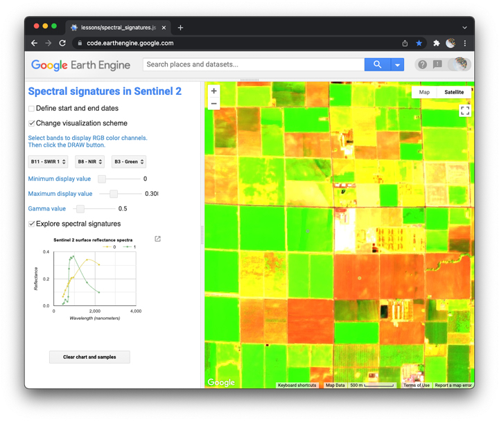

## Spectral signatures  

In this activity, you explore spectral signatures and visualization parameters with an earth engine app.  

_Figure 1. Spectral signature earth engine app._

### Introduction    

To get acquainted with key terms and concepts of spectral signatures, please read [this short article](https://www.esa.int/SPECIALS/Eduspace_EN/SEMPNQ3Z2OF_0.html).  

### Open the app  

I wrote [this earth engine app](https://jhowarth.users.earthengine.app/view/spectral-signatures) to help you explore spectral signatures and visualization schemes with Sentinel 2 images.

[Copernicus Sentinel 2](https://sentinel.esa.int/web/sentinel/missions/sentinel-2) is a mission by the European Space Agency (ESA). The MultiSpectral Instrument aboard these two satellites measures reflectance with 13 bands (Figure 2.)  

  

_Figure 2. Sentinel 2 bands._

We will discuss how to:  

1. Grab image from map center.    
2. Change data range filter.     
3. Plot spectral signature at one or more sample points.  
4. Download the spectral signature chart as a .png.       
5. Change visualization scheme, including RGB composite, display min and max, and gamma.  

### Activity  

_Due by 1/19/2022 at 10am_

First, please explore the spectral signature app and compare the spectral signatures of two similar surface cover types of your choice. For example: conifers versus deciduous trees, rooftops versus pavement, snow versus glacial ice, clear water versus silty water, etc.  

Then please identify a RGB composite and display parameters that you think does a good job visualizing the differences in the spectral signatures of these two surface types.  

You may find [this resource](https://custom-scripts.sentinel-hub.com/custom-scripts/sentinel-2/composites/) helpful when exploring different RGB composites.  

To complete this activity, please fill out this [Google form](https://docs.google.com/forms/d/e/1FAIpQLSdz4EiYOFRrXnGq62APL66N8DWUojk2NjkkPxQZAXfOPB7s9Q/viewform?usp=sf_link).  

Thank you!    
