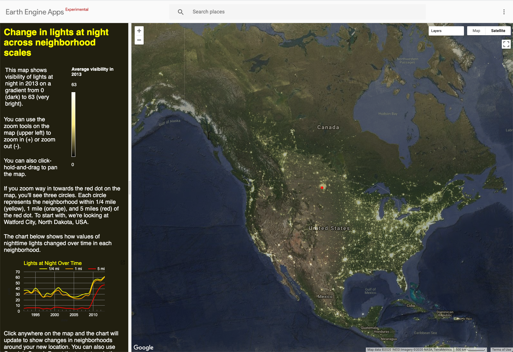
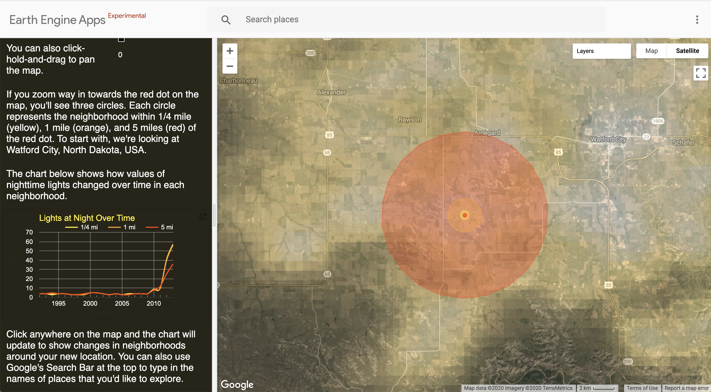

## Objectives

In this lesson, we'll explore how the scale of spatial observations influence measurements of change over time. We'll also explore insights that can be gained by comparing change over time at multiple spatial scales.

## Setting Up

### Open the GEE app

To get us started, open the app by right-clicking on the image below and opening the link in a new browser tab or window.

### Zoom in

Let's zoom into the center of the map by clicking the + icon in the upper left corner. With each click, you'll zoom into a point centered on Watford City, North Dakota.

The three circles represent neighborhoods around the red point that are drawn with different radii:  

* Yellow circle represent a 1/4 mile neighborhood
* Orange circle represents a 1 mile neighborhood  
* Red circle represents a 5 mile neighborhood

## Explore under the layers

### Change visible layers

With the **layers** button on the map, uncheck the bottom three layers so that the only visible layers are the 1/4 mile circle and the point of interest.

Then zoom in a little more so that you can see some details in the Satellite basemap.

### Interpret land cover within 1/4 mile neighborhood

Take a moment to try to answer the question below. Then click on the question to compare thoughts.  

Describe the land cover you see within the 1/4 mile circle

 
<i>It might be hard to think of a place in North Dakota as "urban," but the land cover in this 1/4 mile neighborhood has qualities that are urban in character. If you really zoom in, you'll recognize roads, parking lots, driveways, rooftops, cars, etc. You'll also see yards and trees. You can probably imagine the land uses associated with these patterns of land cover: residential streets and a commercial center. </i>

### Compare landcover within 1 mile neighborhood

Now make the 1 mile circle the only layer visible and look at the land cover in this neighborhood. You'll likely need to zoom out a little bit to fit the circle in the map window. Try to answer the question below. Then click on it to compare thoughts.

How does landcover within 1 mile of the city center differ from landcover within 1/4 mile?

 
<i>There's more variation in landcover within the bigger circle. There are some cultivated lands and wetlands in this neighborhood. There's also dense "strip" development along the main roads and some industrial development (for example, in the north area). </i>

### Compare landcover within 5 mile neighborhood

Now investigate the 5 mile radius circle and try to answer the question below. Then click on it when you're ready to compare thoughts.

How does landcover within 5 miles of the city center differ from landcover within the other circles?

 
<i>In the largest circle, the majority of land appears to be agricultural. There's also a very noticeable pattern of bare rectangles within the agricultural lands that seem to be associated with secondary roads.</i>

## Investigate change across scales

### Interpret the chart

OK, so now that we've investigated how land cover differs within each of our circles, let's look at the chart in the app that shows how each of these neighborhoods changed over the extent of the data record.

Take a look at the chart and then try to answer the three questions below.

What's similar about the way all three lines change and what do you think causes this?

 
<i>Beginning in 2010, all three neighborhoods show an abrupt increase in brightness. This marks the start of the fracking boom, which brought more people to the town. This likely encouraged more commercial development. It also brought development of fracking infrastructure around the town and scattered along secondary roads. </i>

Why are the yellow and orange so similar in the way that they change?

 
<i>The yellow line is always a little higher than the orange, which makes sense since we saw that the orange circle included more of a mix of urban and agricultural lands. It also suggests something about the size of Watford City. The two lines are close and this suggests the size of the city is not quite two miles across, but nearly so. </i>

Why does the red line differ from the other two lines?

 
<i>This shows that the nearby area outside of the city was largely rural with few lights at the beginning of the record. With the fracking boom, the visibility of lights in rural lands near the city increased quite rapidly. This could be from some increased urban development (commercial and residential) and also from the development of gas fields near the city (those rectangular patches of bare ground along secondary roads). </i>

### Explore nearby locations outside of the city

Let's explore a location outside of Watford City. I zoomed out a bit and then clicked on another location to the southwest of Watford City.

By clicking, the app updated the chart so that now it shows changes in the three neighborhoods around this new point. Look at this chart and then try to answer the questions below.

Why do the three lines lie on top of each other for all the years prior to 2010?

 
<i>This suggests that this whole area was agricultural land (with very few sources of lights at night) until about 2010. At this time, the development from fracking began in the region.</i>

Why do the yellow and orange lines depart from the red line after 2010?

 
<i>This suggests that development was more concentrated here. By about 2012, the neighborhood within 1 mile of this location began to develop more intensively than the land within 5 miles.</i>

### Explore a different region

Use the app to explore different locations. In the Google's Search bar in the top banner of the app, type in "Frisco, TX, USA". Then click on the center of the map so that the app updates the chart for this location.

Try to answer the questions below.

What does the chart tell you about the way Frisco, TX changed ?

 
<i>You tell me :).</i>

Now search for "Plano, TX, USA" and click in the center of the map to update the chart.

What does the chart tell you about the way Plano, TX changed and how do these changes differ from Frisco?

 
<i>You tell me :).</i>

Now search for "Westfalls Village, Frisco, TX, USA" and click on the center of the map to update the chart.  

What does the chart tell you about the way Westfalls Village has changed and how do these changes differ from the other two places we've looked at in Texas?

 
<i>You tell me :).</i>

### Explore on your own  

Go ahead and use the app to explore how other places in the world have changed. Try to identify at least one other place where looking at changes across neighborhood scales is particularly insightful.
