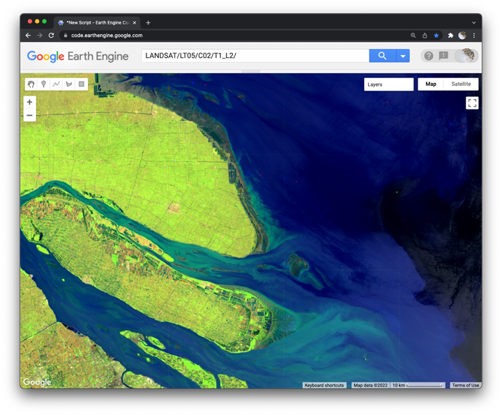
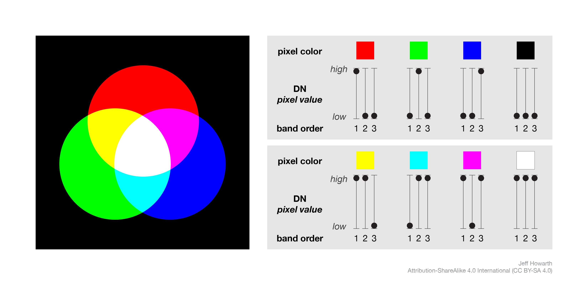

## RGB composites    

_Adapted from: 'Exploring images' by J. Howarth in 'Cloud-based Remote Sensing with Google Earth Engine'. Edited by J. Cardille, N. Clinton, M. Crowley, D. Saah. Springer. Summer 2022._

In this lesson, we explore additive color as a method to visualize three different bands in a single composite layer. We then compare different kinds of composites for satellite bands that measure visible and non-visible portions of the electromagnetic spectrum.


<br>
_Figure 1. SWIR false-color composite._

### Landsat 5 TM bands
<br>


_Figure 2. In the Earth Engine data catalog, the USGS Landsat 5 Level 2, Collection 2, Tier 1 collection was collected by the Thematic Mapper (TM) instrument [(image source)](https://www.usgs.gov/media/images/bandpass-wavelengths-all-landsat-sensors)._

### Additive color
<br>



_Figure 3. RGB composites. Red, green, and blue combine to make yellow, cyan, magenta, white, or black. The sequence of bands assigns primary colors (first, second, third = Red, Green, Blue). Pixel values in each band determine color tint and intensity._

### Review histograms of image bands  

Please refer back to the _displaying_bands.js_ script that we wrote in our last meeting. Look at the histograms that we produced for the first four bands and write down the min and max data values for each.  

Next please make two more histograms for Band 5 and Band 7. Please write down the min and max data values for each.  

### Begin a new script  

```js
//  ~~~~~~~~~~~~~~~~~~~~~~~~~~~~~~~~~~~~~~~~~~~~~~~~~~~~~~~~~~~~~~~~~~~~~~~
//  Title:        RGB composites
//  Author:       Jeff Howarth
//  Last edited:  2/22/2022   
//          
/* In this lesson, we explore additive color as a method to visualize three
  different bands in a single composite layer. We then compare different kinds
  of composites for satellite bands that measure visible and non-visible portions of the electromagnetic spectrum. */  
// ~~~~~~~~~~~~~~~~~~~~~~~~~~~~~~~~~~~~~~~~~~~~~~~~~~~~~~~~~~~~~~~~~~~~~~~

// Load an image from its Earth Engine ID.

var first_image = ee.Image('LANDSAT/LT05/C02/T1_L2/LT05_118038_20000606');

// Center the Map on the image prior to adding layers to the Map.

Map.centerObject(first_image, 10);

// Change base layer to hybrid (satellite with labels).

Map.setOptions('HYBRID');
```

### Natural color composite (321)

```js
// Add a natural color layer by using the first three sensor bands for RGB.

Map.addLayer(
    first_image,
    {
      bands: ['SR_B3', 'SR_B2', 'SR_B1'],
      min: 8000,
      max: 14000
    },
    'Natural Color 321');
```

<details>
<summary><b>Check your understanding.</b></summary>
<br>
Why does a <b>natural color</b> composite look like the world we would see from an airplane or drone?
</details>  

```js
// Add a natural color layer by selecting the first three sensor bands.

Map.addLayer(
    first_image
      .select(['SR_B3', 'SR_B2', 'SR_B1']),
    {
      min: 8000,
      max: 14000
    },
    'Natural Color 321 (select method');  
```

<details>
<summary><b>Check your understanding.</b></summary>
<br>
<li>Use the Inspector tool to explore the two layers. How are the two images different? Why do they look the same?</li>
<br>
<li>Why does the sediment plume look light brown? Why does clear water appear black? Why does nearshore water appear blue-green?</li>  
</details>

### NIR false-color composite (432)

```js
// Add a NIR false-color layer using NIR, red, green sensor bands for RGB.

Map.addLayer(
    first_image.select('SR_B4', 'SR_B3', 'SR_B2'),
    {
      min: 8000,
      max: 14000
    },
    'NIR false-color 432');
```

<details>
<summary><b>Check your understanding.</b></summary>
<br>
<li>Activate the <b>Inspector</b> panel, click on a location that appears bright red, and then look at the pixel values for each band. Why does the location appear bright red? </li><br>
<li>Click on water that appears black and compare the pixel values for that location to a place where the water appears whiter and tinted with cyan. How do the pixel values at these locations compare to the additive color chart above?</li>     
</details>  

```js
// Select NIR, Red, and Green bands (filtering image).  
// Then add a NIR false-color layer.

Map.addLayer(
    first_image.select('SR_B4', 'SR_B3', 'SR_B2'),
    {
      min: [8000, 8000, 8000],
      max: [20000, 14000, 14000]
    },
    'NIR false-color 432 (method 2)');
```

<details>
<summary><b>Check your understanding.</b></summary>
<br>
<li>Why is there less bright red on this layer compared to the previous layer? </li>
<br>
<li>What kinds of land cover does this second False Color composite help you see that were less apparent in the first False Color composite?</li>    
</details>  

### SWIR false-color composite (542)  

```js
// Add a SWIR false-color layer using SWIR, NIR, green sensor bands for RGB.
Map.addLayer(
    first_image.select(['SR_B5', 'SR_B4', 'SR_B2']),
    {
      min: [7000, 7500, 8000],
      max: [18000, 22000, 14000]
    },
    'Short wave false color 542');
```

<details>
<summary><b>Check your understanding.</b></summary>
<br>
Why do some locations appear bright green or cyan or reddish? How do the pixel values at these locations compare to the additive color chart above?   
</details>  

### SWIR2 false-color (742)  

Please make a false color composite that display bands 7,4,2 as RGB.

```js
// Add a 742 composite layer.
Map.addLayer(
    XXXX,
    {
      min: XXXX,
      max: XXXX
    },
    XXXX);
```

<details>
<summary><b>Check your understanding.</b></summary>
<br>
<li>Compare the first SWIR false color layer that you made to this one. How do they differ? What kinds of land cover does the SWIR2 composite help you see?</li>
<br>
<li>Notice that the 'HYBRID' base layer is a more recent image than our Landsat scene. What kinds of land cover changes can you see by comparing the Landsat scene to the hybrid base layer?</li>
<br>      
</details>  

### 453 composite    

```js
// Add a 453 composite layer.  
```

<details>
<summary><b>Check your understanding.</b></summary>
<br>
<li>What kind of land cover does this composite help you see?</li>
<br>      
</details>

### Further reading  

[This webpage](http://web.pdx.edu/~nauna/resources/10_BandCombinations.htm) provides more information on different RGB band combinations and what they can help you see.
