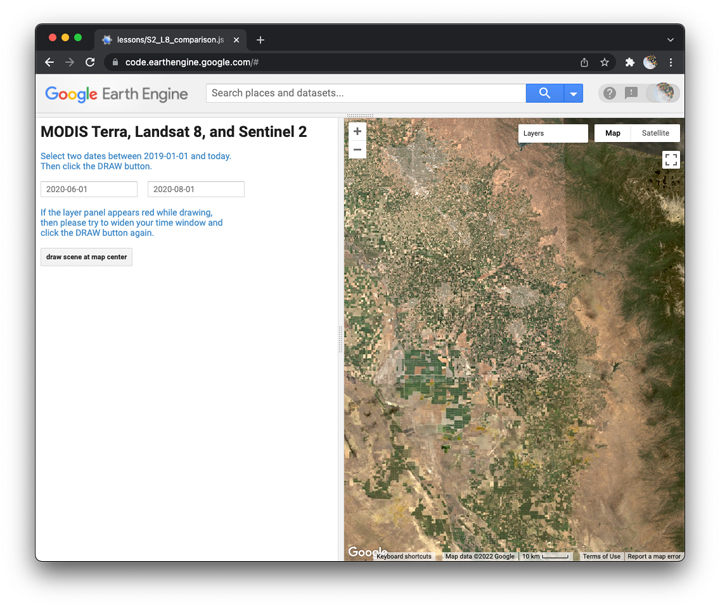

## Data comparisons

In this lesson, we begin by exploring an earth engine app to visually compare sensors mounted on three different satellites (Terra, Landsat 8, and Sentinel 2). This helps us see differences in pixel resolution, geographic extent, and the ability to filter a collection by attributes (like how cloudy the image appears). We then write a script to compose a map with layers from each satellite demonstrated by the app. This establishes a basic workflow for working with earth engine datasets: load, inspect, filter, reduce, scale, and visualize. By implementing this workflow for three different datasets in the same script, you learn strategies for making your code more efficient, less redundant, and easier to update.  

  

### Explore three sensors  

I wrote this [earth engine app](https://jhowarth.users.earthengine.app/view/eeprimer-compare-satellites) to help you quickly load, filter, reduce, scale, and display images from three different sensors:  

* [MODIS](https://modis.gsfc.nasa.gov/about/) (Moderate Resolution Imaging Spectroradiometer) aboard the Terra satellite,    
* OLI (Operational Land Imager) and TIRS (Thermal Infrared Sensor) aboard [Landsat 8](https://landsat.gsfc.nasa.gov/satellites/landsat-8/),  
* and MSI (MultiSpectral Instrument) aboard the [Copernicus Sentinel-2](https://sentinel.esa.int/web/sentinel/missions/sentinel-2).  

_Discuss how to use the app to visually compare spatial attributes of sensors._  

### How to compare datasets   

If you would like to use satellite imagery as evidence, you should be able to explain differences in image datasets. This will help you:  

- choose the best dataset for a research question,  
- conduct longitudinal studies (across time) over a sensor's mission life,
- make comparisons across datasets.  

The questions listed below identify some common differences based on spatial, temporal, spectral characteristics and processing history:  

__Spatial__  
- What are the bands' pixel scale/resolution?  
- What is the regional extent of the collection?  
- Does the collection contain single images or global mosaics?  

__Temporal__  
- When did the mission start and end (temporal extent)?  
- How often do you get a picture of a place (recurrence interval)?  
- What time of day is the picture captured?  
- How long does it take for the picture to get into the earth engine data catalog (latency)?  

__Spectral__  

If the data are spectral (capture reflectance of light):  

- How many bands does the image contain?  
- How do they parse the spectrum?  

__Processing history__  
- Are the data raw or processed?  
- If processed, what criteria or algorithms were applied?  

### Image processing workflow in earth engine

Now we will begin to write a script that draws images from Sentinel-2, Landsat 8, and MODIS-Terra like the app you just explored.  

_Please note: the CODE CHECKPOINT below will allow you to check you work after adding the S2 and L8 collections._  

#### Start with a header

```js
// ~~~~~~~~~~~~~~~~~~~~~~~~~~~~~~~~~~~~~~~~~~~~~~~~~~~~~~~~~~~~~~~~~~
//
// Title:   dataset_comparison.js
// Author:  Jeff Howarth
// Date:    1/18/2022
// Purpose: To make quick comparisons between S2, L8, and Terra (MODIS)
//
// ~~~~~~~~~~~~~~~~~~~~~~~~~~~~~~~~~~~~~~~~~~~~~~~~~~~~~~~~~~~~~~~~~~
```

#### Define map properties   

```js
// Center map on a location and define zoom level.  
// Use the 'TERRAIN' basemap.  
```

#### Load image from Sentinel-2 collection   

```js
// Load image collection from 'COPERNICUS/S2_SR'.
```

#### Inspect first image from collection   

```js
// Print first image to Console.  
```

#### Filter image  

```js
// Filter by location (use the map center).  

// Filter by date range ('2020-06-01','2020-08-01').

// Filter by image property (remove cloudy images from collection).

.filter(                                          // filter
  ee.Filter.lt(                                   // criteria  
    'CLOUDY_PIXEL_PERCENTAGE',                    // property
    20))                                          // value
```

#### Reduce collection to image  

```js
// Reduce to median values at locations.
```

#### Scale the data values  

```js
// For Sentinel 2 product, divide every pixel value by 10000.
```

#### Visualize image on map  

```js
// Construct object for visualization parameters.

// Add layer to map.
```

### Make layer from Landsat 8  

Now repeat this basic workflow to add a layer from the Landsat 8 collection.  

```js
// Load image collection from 'LANDSAT/LC08/C02/T1_L2'.  

var image_L8 =

// Filter by same location as above.  
// Filter by same date range as above.  
// Filter by property (to select images with < 20% cloud coverage from collection).  

// Scale the data values.  

var image_tools = require(                                // Load module.        
  'users/jhowarth/eePrimer:modules/image_tools.js'        // from this address.
);

var scaled_L8 = image_L8                                  // Construct new object for scaled collection.  
  .map(image_tools.applyScaleFactors_L8);                 // Apply scalar function to each image in collection.  

// Construct object for visualization parameters.    

// Add layer to map.      

```

<details>
<summary><b>Check your understanding.</b></summary>
<br>
<li>Which parts of the code for Landsat 8 repeat parts of the Sentinel 2 script?</li>
<br>
<li>How can you avoid defining the same parameters more than once?</li>
</details>
<br>

[**CODE CHECKPOINT**](../scripts/data_comparison.js)

### Make layer from MODIS Terra    

Please add a layer to the map from the MODIS Terra dataset ('MODIS/006/MOD09GA'). Please comment your code as above (one short, complete sentence for each line of code).  

<details>
<summary><b>Check your understanding.</b></summary>
<br>
<li>Which parts of the MODIS script differ the most from the S2 and L8 scripts?</li>
<br>
<li>How are these differences in your scripts related to differences in the datasets?</li>
</details>
