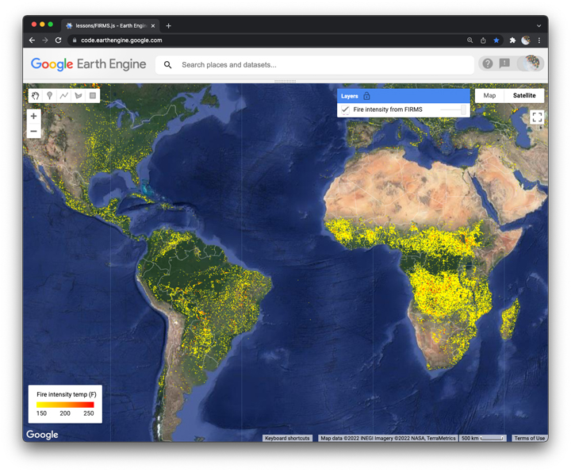

## Global fires  

In this lesson, we work with a global dataset of fires recorded each day for the last twenty years and compare this big picture view with a method for producing high resolution maps of burn intensity using the [**Normalized Burn Ratio**](https://un-spider.org/advisory-support/recommended-practices/recommended-practice-burn-severity/in-detail/normalized-burn-ratio). We estimate the change in NBR and classify levels of fire severity following a large fire on the slow coast of California. We then add a legend to the map that defines our burn severity classes.      

### Background  

_Figure 1: OK in Davenport, CA. August 2020. Source: Bill Henry_

[Billy app](https://jhowarth.users.earthengine.app/view/billy-app)

I made this app to help a friend access maps about burn intensities near Davenport, CA. Because of some of my coding decisions, this app only lets the user explore fires in one year in one state of the USA.

### Global fire explorer

My goal here is to get closer to building something that helps people examine fires anywhere in the world and connect global patterns and histories of fire to local scale details of burn severity, timing, and recurrence.  

  

_Figure 2. [Draft global fire explorer app](https://jhowarth.users.earthengine.app/view/eeprimer-global-fire-explorer)_

Some key concepts:  

#### FIRMS product

The [FIRMS](https://earthdata.nasa.gov/earth-observation-data/near-real-time/firms) dataset (like [VIIRS](https://lpdaac.usgs.gov/documents/427/VNP14_User_Guide_V1.pdf) and [GOES](https://www.goes-r.gov/products/baseline-fire-hot-spot.html)) provides relatively fast information about active fires across the planet. FIRMS also provides a historical record of fire intensities over the last 20 years.  

##### Task 1  

Please try to load and stylize the FIRMS dataset as shown in the figure below.  

[Here is a script](../scripts/firms.js) so that you can check your work.

#### Normalized Burn Ratio  

NBR is similar to NDVI: it is a **normalized ratio** so we are dividing the difference of two bands by their sum. NBR uses the shortwave and Near Infrared bands. Notice how the reflectance at these two wavelengths differ within and between the spectral signatures of both burned areas and healthy vegetation.  

##### Task 2  

Please write a script to compute the normalized burn ratio for the fire near Davenport, CA in August 2020 with Sentinel 2.

#### Burn severity index    

The Burn Severity Index is based on the change in NBR before and after a fire. The thresholds listed below are standards proposed by the USGS. See [Jon Keeley (2007)](https://pubs.er.usgs.gov/publication/70032718) for a discussion of burn severity versus intensity and their ecological functions.

  

##### Task 3  

Building off the script in Task 3, please write a script to compute the burn severity index for the fire. 
