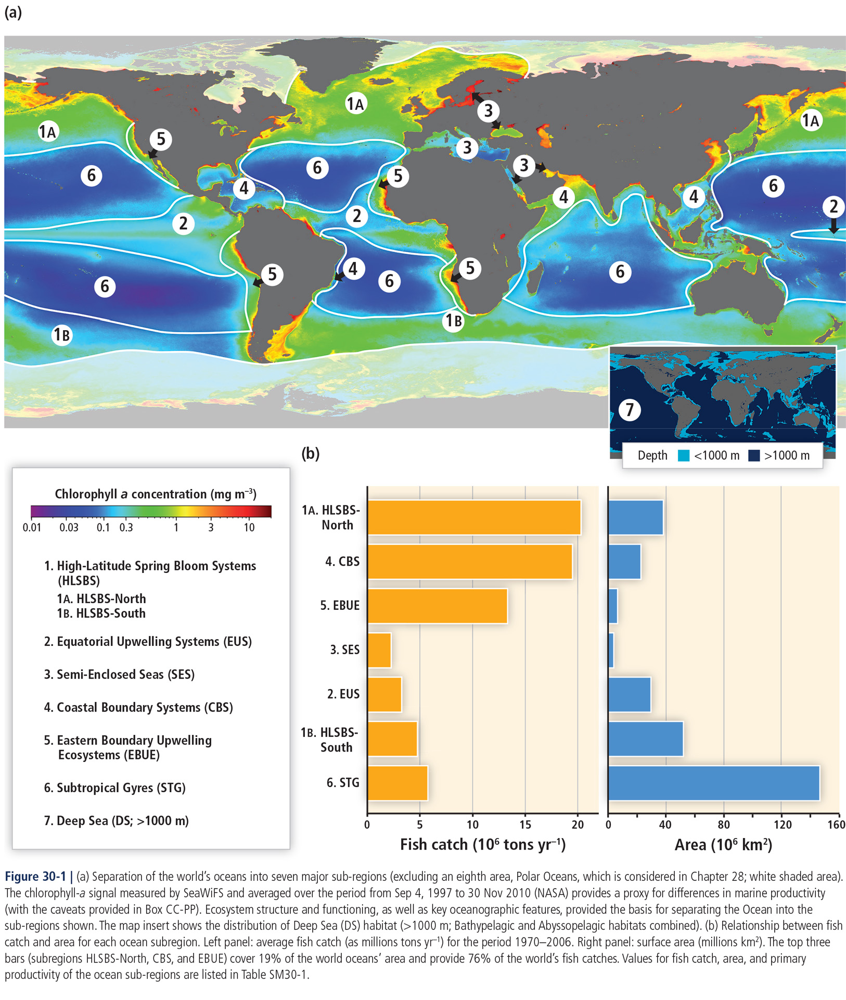

## Global oceans  

In this lesson, we use Earth Engine to explore and reproduce the two maps in this image from [Hoegh-Guldberg et al (2014)](https://www.ipcc.ch/site/assets/uploads/2018/02/WGIIAR5-Chap30_FINAL.pdf).    

  

We start with the inset map of ocean depths. To make this, we need to:  

1. reclassify a bathymetry dataset with _additive thresholds_,
2. apply a _nominal palette_ to distinguish deep and shallow seas,  
3. add a _map key_ for nominal classes.    

After making the inset map, we then explore datasets that underlie the main map and produce a multi-year average of chlorophyll-a concentrations and sea surface temperatures. To do this, we work through a couple of new methods:  

1. display the images with a _community palette_,
2. add a _quantitative legend_.  

We then write and apply a function to generate seasonal images of chlorophyll-a concentrations and sea surface temperatures.

Finally, we will compute difference maps between seasonal chlorophyll-a concentrations.  

Over the weekend, we will aim to connect these mapped patterns to global [ocean circulation](https://ugc.berkeley.edu/background-content/ocean-circulation/) and [atmospheric circulation](https://ugc.berkeley.edu/background-content/atmospheric-circulation/) processes.  

### Header  

```js
//  ~~~~~~~~~~~~~~~~~~~~~~~~~~~~~~~~~~~~~~~~~~~~~~~~~~~~~~~~~~~~~~~~~~~~~~~
//  Title:        Global oceans  
//  Author:       Jeff Howarth
//  Last edited:  4/4/2022   
// ~~~~~~~~~~~~~~~~~~~~~~~~~~~~~~~~~~~~~~~~~~~~~~~~~~~~~~~~~~~~~~~~~~~~~~~

/*  

    GOAL:  Investigate an image from Hoegh-Guldberg et al (2014).

    OUTCOMES:

    We reclassify a bathymetry dataset, apply a palette,
    and add a nominal map key to distinguish deep and shallow seas. We then generate
    a multi-year average of chlorophyll-a concentrations and sea surface
    temperatures, display the images with a community palette a quantitative legend.
    Finally, we write a function to generate seasonal images of chlorophyll-a concentrations
    and sea surface temperatures to visualize annual changes in these two patterns.  

    Conceptually, we interpret the images to explore subdivision of the global oceans and
    the global circulation processes associated with these ocean patterns.

*/
```

### Bathymetry  

```js
// ------------------------------------------------------------------------
// BATHYMETRY  
// ------------------------------------------------------------------------

// Load baythmetry dataset from 'NOAA/NGDC/ETOPO1' and
// select 'ice_surface' band.


// Reclassify image to distinguish deep sea (<-1000 m), sea (>-1000 m), and land (>0 m)


// Create a palette of 'MidnightBlue', 'LightSkyBlue', 'Black'.


// Config viz parameters.   


// Config legend
// -------------

// Load cart module.

var cart = require('users/jhowarth/eePrimer:modules/cart.js');

// Define labels for classes.


// Create map key.

// var bKey = cart.makeLegend(title, palette, labels, position);

// Compose Map
// -----------

// Set center and zoom level of map.
Map.setCenter(-100, 20, 2);

// Add key and layer


```  

### Annual averages from AQUA  

```js
// ------------------------------------------------------------------------
// ANNUAL AVERAGES FROM AQUA IMAGES   
// ------------------------------------------------------------------------

// Define start and end year (2018, 2020).


// Load image collection from 'NASA/OCEANDATA/MODIS-Aqua/L3SMI'
// Filter by start and end years.


// Create variable to store 'chlor_a' band and reduce by mean.


// Create variable to store 'sst' band and reduce by mean.


```

### Compose map of annual averages  

```js
// ------------------------------------------------------------------------
// COMPOSE MAP OF ANNUAL AVERAGES  
// ------------------------------------------------------------------------

// Load Earth Engine community palettes

var palettes = require('users/gena/packages:palettes');

// Config palettes for chlorophyl and temperature

var cPalette = palettes.niccoli.linearl[7].slice(0,5);

var tPalette = palettes.kovesi.rainbow_bgyr_35_85_c72[7];

// Config viz parameters for chlorophyll-a (0 - 2) and sst layers (0 - 35).


// Make map keys.  

var tKey = cart.makeGradientLegend(viz, title, position);
var cKey = cart.makeGradientLegend(viz, title, position);

// Compose map (legend, layer).


```

### Construct seasonal images  

```js
// ------------------------------------------------------------------------
// CONSTRUCT SEASONAL IMAGES
// ------------------------------------------------------------------------

// Write function to make images.


// Apply function to make images for fall, summer, spring, winter  
// for both chlorophyll-a and sea surface temperatures.      


// Compose map.  

```
### Compose difference maps  

```js
// ------------------------------------------------------------------------
// COMPOSE DIFFERENCE MAPS   
// ------------------------------------------------------------------------

// Compose difference layer between spring and winter seasons for chlorophyll-a.


// Create palette for seasonal difference layer.

var diff_chlor_palette = palettes.colorbrewer.PiYG[11];

// Create viz parameters for seasonal difference in Chlorophyll.

var diff_chlor_viz = {
  min: -2,
  max: 2,
  palette: diff_chlor_palette
};

// Make a map key for chlor-a difference.  


// Add difference layer to map.


// Write a function to compute difference layers between seasonal chlor-a concentrations.


// Compose difference layers for three other seasonal transitions.


// Add different layers to map (with LST viz parameters).  

```
### Add geographic reference lines    

```js
// ------------------------------------------------------------------------
// ADD GEOGRAPHIC REFERENCE LINES   
// ------------------------------------------------------------------------

// Load graticule (lines of lat and long).

var graticule_10d = ee.FeatureCollection('projects/ee-primer/assets/reference_lines/graticule_10d');

// Load geographic lines (equator, circles, tropics).

var geographic_lines = ee.FeatureCollection('projects/ee-primer/assets/reference_lines/geographic_lines');

// Add graticule and geographic lines as reference lines.

Map.addLayer(graticule_10d, {color: 'Honeydew'}, 'Graticule 10 degrees',0);
Map.addLayer(geographic_lines, {color: 'Gainsboro'}, 'Geographic lines',0);


```

### Reference

Hoegh-Guldberg, O., R. Cai, E.S. Poloczanska, P.G. Brewer, S. Sundby, K. Hilmi, V.J. Fabry, and S. Jung, 2014: The Ocean. In: _Climate Change 2014: Impacts, Adaptation, and Vulnerability. Part B: Regional Aspects._ Contribution
of Working Group II to the Fifth Assessment Report of the Intergovernmental Panel on Climate Change [Barros, V.R., C.B. Field, D.J. Dokken, M.D. Mastrandrea, K.J. Mach, T.E. Bilir, M. Chatterjee, K.L. Ebi, Y.O. Estrada,
R.C. Genova, B. Girma, E.S. Kissel, A.N. Levy, S. MacCracken, P.R. Mastrandrea, and L.L.White (eds.)]. Cambridge University Press, Cambridge, United Kingdom and New York, NY, USA, pp. 1655-1731
