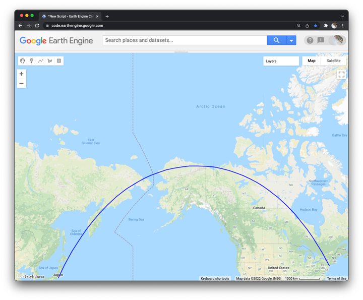

## Great circles  



In this lesson, we will use geometry tools to draw a __great circle route__ between two geographic points. A great circle route represents the shortest path across the globe between two locations. The shape of a great circle route on a map helps reveal distortions generated from a map's __projection__, or the cartographic method used to display the Earth on a flat surface.  

Like many web maps, the Google Map UI users a __Web Mercator__ projection. This projection preserves angles. On maps with Mercator projections, a straight line represents a line of constant bearing. This helps people navigate with magnetic compasses. In contrast, a great circle arc will not appear straight, but will instead bend poleward.     

### Draw two points  

To start, we need to draw two points:

1. Use the __Point geometry tool__ to create a point on the _Haneda Airport_ in Tokyo, Japan.

_Hint: use the Search tool to quickly recenter the map based on placenames._

2. Then click the __geometry imports__ panel and click __+ new layer__.  

3. In the new layer, use the __Point geometry tool__ to create a point on the JFK airport in New York, New York.  

### Explore the code  

You may notice that by using the point geometry tool, we added a new panel at the top of the Code Editor called __Imports__. Notice that there is a little blue icon at the end of the first line. If you click on this, it will generate code that you can embed into the script. My code looked like this:    

```js
var geometry = ee.Geometry.Point([139.77926249628308, 35.545853491820665]);

var geometry2 = ee.Geometry.Point([-74.17068033088691, 40.689334262788805]);
```

Your coordinates should be close to this but probably will not be exactly the same.

<details>
<summary><b>Check your understanding:</b></summary>
<br>
Use the following key terms to describe what this code does:
<br><br>
<li>variable
<li>object
<li>method
<li>arguments
<li>list
</details>

### Create line  

Next we will construct a new line geometry object from our two points.   

```js
var line = ee.Geometry.LineString([geometry, geometry2]);
print('Great circle arc', line);
```

<details>
<summary><b>Check your understanding:</b></summary>
<br>
Use the following key terms to describe what this code does:
<br><br>
<li>variable
<li>object
<li>method
<li>arguments
<li>list
</details>

### Add layer to map      

Now we can add the line to the map with a __layer__ and display the line with a color.

```js
Map.addLayer(line, {color: 'blue'}, "Great circle line");
```

<details>
<summary><b>Check your understanding:</b></summary>
<br>
<li> How many parameters does the Map.addLayer method take?
<br>
<li> What type of object is each parameter?
<br>
<li> What do you think each parameter does?  
</details>

### Center map on an object

As a final step, we can make the map centered on the line object and change the zoom level so that the whole line fits on the display screen.

```js
Map.centerObject(line,3);
```

<details>
<summary><b>Check your understanding:</b></summary>
<br>
<li> What do you think the number 3 represents as a parameter?  
</details>
