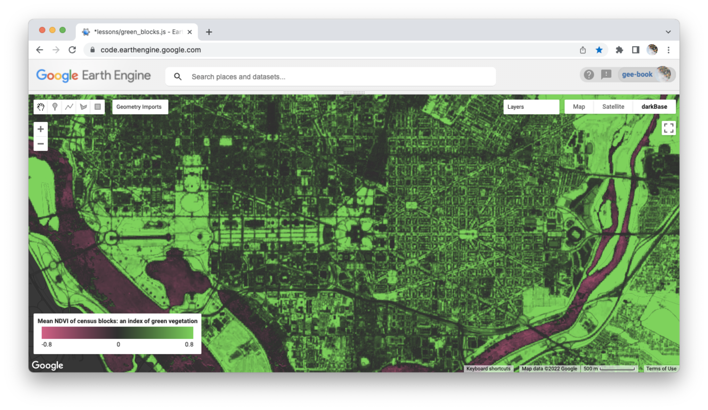
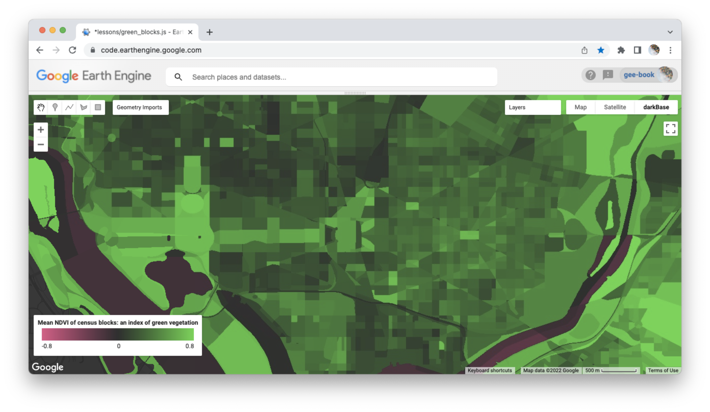

## Geographies of green blocks      

The goal for this lesson is to make a map that shows the mean normalized difference vegetation index (NDVI) within census blocks of Washington, DC.  

  

_Figure 1. Mean NDVI of census blocks in Washington, DC._  

This lesson introduces several new concepts:  

1. normalized difference vegetation index (NDVI)  
2. zonal statistics  
3. choropleth map  

After introducing these concepts, you develop a script in Earth Engine that uses a Sentinel 2 image to compute NDVI, summarize this layer with regions from another layer, and display the result as a choropleth map. The script should allow you to quickly reproduce the map for any city in the United States simply by changing the point of interest geometry feature.  

## Concepts  

### NDVI  

Please open the [spectral signature app](https://jhowarth.users.earthengine.app/view/spectral-signatures) and do the following:  

1. Navigate to Washington, DC and zoom in so that the map frame encompasses the National Mall.  

2. Leave the start and end dates as defined.  

3. Change the visualization scheme to a false color NIR composite.  

4. Explore spectral signatures and click on one location with healthy vegetation and one location with impervious surfaces.  

5. Open the spectral signature chart.  

6. Write down the reflectance values of the NIR (835) and Red (665) bands for each sample point.  

7. Calculate the NDVI for each sample point.  

   

> DISCUSS RESULTS.  

_Please note: there are a number of other normalized indices that are used for other types of land cover, including normalized difference water index (NDWI), normalized difference snow index (NDSI), and normalized burn ratio (NBR), that follow the same general formula of a ratio between the addition and subtraction of two band values._

### Zonal statistics  

In spatial analysis, a **zonal statistic** uses the boundaries of one or more features in one layer to summarize the pixel values of a second layer. For some people, it can be helpful to think of an analogy involving cookie cutters and cookie dough. One layer serves as cookie cutters that provide the shapes to cut up a second layer (the dough).  


_Figure 2. Cookie cutters provide the shapes to impress on the dough, always leaving traces of their shapes in the output. Photo source: www.culinaryhill.com_  

>_Diagram how zonal statistic works with a vector cutter and raster dough on the board._

### Choropleth map  

A **choropleth** map displays values aggregated by regions. For example, Figure 3 shows raw NDVI values in a portion of Washington, DC, while Figure 4 shows the average NDVI value in census blocks for the same region. Figure 4 is an example of a choropleth map, or a map that shows values aggregated by regions.  

  
_Figure 3. Raw NDVI in DC._  

  
_Figure 4. Average NDVI in DC census blocks._  

In other words, you typically display the results of zonal statistics as choropleth maps. One of the utilities of this workflow is that it enables you to make comparisons between human and natural systems. In human geography, most social and economic datasets are aggregated by some sort of areal unit (like census polygons). Zonal statistics and choropleth maps provide a means to organize environmental data in these same observation units so direct comparisons can be made.  

As we will discuss later, choropleth maps are best suited for displaying ratio data, like averages, percentages, and densities.    

## Write a script  

### Start with a header   

To get started, copy and paste this code block into a blank script and then save the script in your lessons folder.  

```js
// ~~~~~~~~~~~~~~~~~~~~~~~~~~~~~~~~~~~~~~~~~~~~~~~~~~~~~~~~~~~~~~~~~~
/*

  OBJECTIVE: Derive mean NDVI in census blocks for any city in the USA

  FILE:      green_blocks.js
  AUTHOR:    Jeff Howarth
  DATE:      April 12, 2022

  PURPOSE:

  In this lesson, you first compute NDVI with a Sentinel 2 image.
  You then learn how to summarize this continuous data within discrete
  regions as a ZONAL STATISTIC. Then to display the summarized data as
  a CHOROPLETH MAP, you CONVERT VECTOR TO RASTER and  so that you can
  display the rasterized image with a colors.

*/
// ~~~~~~~~~~~~~~~~~~~~~~~~~~~~~~~~~~~~~~~~~~~~~~~~~~~~~~~~~~~~~~~~~~

```

### Configure the map.  

Please configure your map so that it centers on Washington, DC at zoom level 12. To do this, please create a poi somewhere in DC (I put on a point on the Capitol dome).  

```js
// --------------------------------------------------------------------
// CONFIGURE MAP.
// --------------------------------------------------------------------

// Center map on point geometry at zoom level 12.


```


### Make cookie cutters   

In this lesson, we want to use a sub-set of the Census blocks feature collection available on Earth Engine as our cookie cutters. We do not want to use all of the Census blocks in the collection, because this would be computationally expensive and very slow. Instead, we want to filter the feature collection to select only the blocks in one county and we want to be able to update (and change) the selected county very easily so that we can easily apply our model to study any city in the country.  

Your task is to write a script that does the following:  

1. Select a county that intersects a point of interest.  

2. Select all of the census blocks that intersect the county that you selected in step 1.   

```js

// --------------------------------------------------------------------
// MAKE COOKIE CUTTERS.
// --------------------------------------------------------------------

// Import county polygons from "TIGER/2018/Counties".

// Print selected county to Console.

// Import block polygons from "TIGER/2010/Blocks" that intersect selected county.

// Print first block feature to Console.


// Add layer of block features in selected county and display
// with 'gold' color. Please label 'select blocks' and do not
// make the layer visible by default.

```

<details>
<summary><b>Check your understanding.</b></summary>
<br>
Why did we not just select the blocks with the point and skip the step of selecting the county first?  
<br>
</details>

### Make the dough    

First, please load an image collection then filter and reduce as follows:  

- from collection "COPERNICUS/S2_SR"  
- filter by poi  
- filter for month of June  
- filter for 'CLOUDY_PIXEL_PERCENTAGE' < 20  
- reduce to median  
- scale by S2 scaler  
- clip by cutter [_hint: .clip(cutter_name)_]    

Then display the layer on the map as a natural color composite, again making the layer not visible by default.

```js

// --------------------------------------------------------------------
// MAKE THE DOUGH.
// --------------------------------------------------------------------

// Load and filter image.

var S2 =

// Print S2 image to Console.  


// Define visualization parameters for natural composite.


// Display selected S2 as natural color composite
// Make layer not visible by default.  


```

<details>
<summary><b>Check your understanding.</b></summary>
<br>
<li>What did the <b>clip</b> function do?</li>  
<br>
<li>What are the computational costs of clipping the image (why should you use this function cautiously)?</li>
</details>
<br>

Next, we derive the normalized difference of vegetation index (NDVI) using the near-infrared and red bands.  

To do this, please look up the .normalizedDifference method in the Earth Engine docs and then use this method in your script.  

Then add the layer to the map with the provided display parameters.  

```js

// Derive NDVI from S2.


// Define visualization parameters for NDVI.

var ndvi_viz = {
  min: -0.8,
  max: 0.8,
  palette: ['#E62E8A', '#2B2B2B', '#2EE62E']
};

// Add NDVI layer to map and make not visible by default.

```
### Cut the dough    

In this step, we compute a summary statistic of the NDVI pixel values (dough) within each block feature (cutters) and then display the result as a map layer.

First, we derive the mean NDVI within each block (a zonal statistic). Please replace the XXXX with the name of your dough, YYYY with the name of your cutter, and ZZZZ with the name of the reducer you used to compute the mean. Please refer to the EE docs when selecting your reducer. [_Hint: you want the reducer that will compute the mean._]  

```js
// --------------------------------------------------------------------
// CUT THE DOUGH.
// --------------------------------------------------------------------

// Derive mean NDVI within each census block.

var zonalStat = XXXX                  // create output from ndvi input (dough)
  .reduceRegions({                    // compute a zonal statistic
    collection: YYYY,               // cookie cutters (regions for statistic)
    reducer: ZZZZ,       // statistic (of dough in cutter)
    scale:10                          // if possible, same as dough
  }
);

// Print the first feature in the collection to Console.  
// Look to see how features store the zonal statistic.

print('Output of zonal statistic', zonalStat);

```
<details>
<summary><b>Check your understanding.</b></summary>
<br>
<li>Where do you find the zonal statistic in the output?</li>
<br>
<li>How would you alter the script to derive a different zonal statistic, such as the median, minimum, or maximum value?
</details>
<br>

### Convert vector to raster  

Next, we need to convert the feature collection into an image. We will use values of a feature property in the collection to populate the values of pixels in the image. This step is necessary because Earth Engine is currently not able to represent feature properties with colors on a map layer. In other words, earth engine can not make **choropleth** maps with vector data, so you must convert vectors to rasters and then display the pixel values with a palette.  


```js

// Import image tools module

var imageTools = require('users/jhowarth/eePrimer:modules/image_tools.js');

// Convert feature collection into an image.

var zonalStatImage = imageTools       // module
  .makeImageFromFeatures(             // function
    XXXX,                        // feature collection  
    YYYY                            // property of fc to use as pixel values
  )
;

// Inspect output of vector - raster conversion.

print('Image converted from feature collection', zonalStatImage);

// Display zonal statistic image output with NDVI color ramp.

Map.addLayer(zonalStatImage, ndvi_viz, 'Mean NDVI in blocks');
```
<details>
<summary><b>Check your understanding.</b></summary>
<br>
<li>How do you find the property name to populate the pixel values?</li>
<br>
<li>When converting the output of a zonal statistic to a raster, what determines the name of the property you should use to populate the pixel values?</li>
</details>
<br>

### Compose map   

These last steps aim to help people read and understand your results.

Please provide **key** (legend) that defines what the colors of the NDVI layers represent. In the snippet below, you will need to replace the XXXX, YYYY, and ZZZZ placeholders with correct inputs. Your legend should be identical to Figure 1.    

Please also provide a **dark base** map to improve contrast and legibility of the NDVI values and base map. In the snippet below, I provide you with a base map I made. If you would like to make your own in the future, here is [a tutorial](https://developers.google.com/earth-engine/tutorials/community/customizing-base-map-styles).   

```js
// --------------------------------------------------------------------
// COMPOSE MAP.
// --------------------------------------------------------------------

// Import cart module.

var cart = require('users/jhowarth/eePrimer:modules/cart.js');

// Construct legend  

var legend = cart                                                     // module
  .makeGradientLegend(                                                // function
    XXXX,                                                         // viz parameters
    YYYY,    // legend title
    ZZZZ                                                     // position on map
  )
;

// Place legend on map.  

Map.add(legend);


```

<details>
<summary><b>Check your understanding.</b></summary>
<br>
<li>What should you consider when writing a title for a key?
</details>
<br>


### Re-applications  

If you have written this code successfully, you should be able to re-apply the script to any city in the USA where there is census data. Please change your poi to apply the script to another city of your choice and then show your result to either Jeff or Derrick.

When we have approved your work, you are free to leave lab.  
