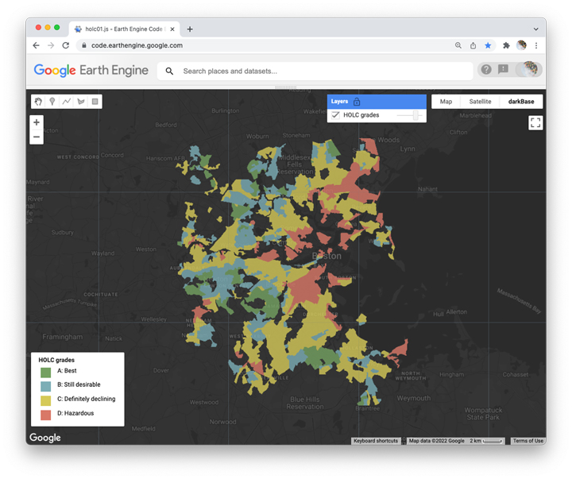
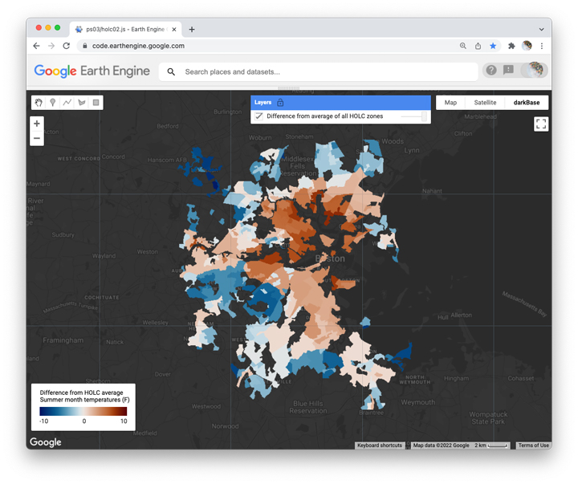

## Legacies of summer temperatures  

Please reproduce the two maps shown in Figure 1 and 2.



_Figure 1. HOLC grades for Boston neighborhoods._  

  

_Figure 1. Difference of average summer temperatures in each HOLC zone from average summer temperatures in all HOLC zones of study area._

## Background  

In the 1930s, the Home Owners' Loan Corporation (HOLC) graded neighborhoods in US cities into risk categories for mortgage lenders. In large part, these grades were based on the racial and ethnic make-up of the neighborhoods: neighborhoods with people of color and new immigrants were marked as 'declining' or 'hazardous', while neighborhoods with ethnicities that migrated into the country in large numbers before the 20th century ('white people') were graded 'best' and 'still desirable'.  

Researchers at the University of Richmond have made a helpful interactive map to show the HOLC maps and neighborhood grades for all US cities. [Here is an example for Boston, MA.](https://dsl.richmond.edu/panorama/redlining/#loc=11/42.338/-71.151&mapview=graded)  

In part 1, you goal is to convert a feature collection of HOLC neighborhoods into an image that displays the neighborhood grades with their original color scheme for Boston, MA. This will allow you tom compare the HOLC neighborhoods to environmental conditions in part 2.

In part 2, you will explore the legacies of the HOLC grades that are measurable in the environmental conditions of many US cities today. Conceptually, you will use zonal statistics to estimate the mean summer temperature (July and August) in each HOLC zone in a study region. You will then use zonal statistics to estimate the mean summer temperature in all of the HOLC zones combined (ie. the union) in the study region.  

You will then make a layer that estimates the difference in the average summer temperature of each individual HOLC zone from the average summer temperature of all the HOLC zones combined.  

The resulting map should help the map reader explore these kinds of questions:    

* Are the average summer temperatures in 'hazardous' (red) and 'definitely declining' (yellow) zones considerably higher than the average summer temperature of all the HOLC zones together?  

* Are the average summer temperatures in the 'best' (green) and 'still desirable' (blue) zones considerable lower than the average summer temperature of all the HOLC zones together?  

The underlying idea is that land surface temperature in the hottest part of the year is an indicator of the environmental quality of a neighborhood and an indicator of the environmental resilience of places to climate change. Neighborhoods with more tree canopy and water features tend to be cooler during heat spells compared to neighborhoods without these natural amenities. When these environmental amenities are unevenly distributed, it may illustrate a case of distributive injustice.  

## Part 1       

```js
//  ~~~~~~~~~~~~~~~~~~~~~~~~~~~~~~~~~~~~~~~~~~~~~~~~~~~~~~~~~~~~~~~~~~~~~~~
//  HOLC legacies  
//  Part 1
//  ~~~~~~~~~~~~~~~~~~~~~~~~~~~~~~~~~~~~~~~~~~~~~~~~~~~~~~~~~~~~~~~~~~~~~~~

// Load modules

var imageTools = require('users/jhowarth/eePrimer:modules/image_tools.js');
var cart = require('users/jhowarth/eePrimer:modules/cart.js');
var customBase = require('users/jhowarth/eePrimer:modules/darkBase.js');

// Define POI as geographic center of Boston: [-71.093556, 42.315528]


// Buffer POI by 20 kilometers to define the study site


// Import feature collection of HOLC zones from 'projects/ee-primer/assets/holc_numeric_grades'
// and filter the collection for features that overlap studyRegion.


// Convert filtered feature collection of HOLC zones into an image.
// Use the 'grade' property of features to populate raster pixel values.  


// Define vis parameters for HOLC image.
// Min value = 0, Max value = 3.
// Use palette: ['#74a161','#7caeb6','#d5c958','#d97867']


// Set base map to darkBase theme.


// Center map on filtered HOLC collection and set zoom level to 11.  


// Add layer to map.
// Set opacity to 0.8.


// --------------------  
// Make and add legend.
// --------------------

// Labels for legend.

var holcGrades = [
  'A: Best',
  'B: Still desirable',
  'C: Definitely declining',
  'D: Hazardous'
  ]
;

// Make legend.

var legend = cart.makeLegend(
  'HOLC grades',
  holcVis.palette,              // If this faults, make sure the name matches your vis parameters.
  holcGrades,
  'bottom-left'
);

// Add legend to map.

Map.add(legend);

```

### Part 2

```js
//  ~~~~~~~~~~~~~~~~~~~~~~~~~~~~~~~~~~~~~~~~~~~~~~~~~~~~~~~~~~~~~~~~~~~~~~~
//  Part 2
//  ~~~~~~~~~~~~~~~~~~~~~~~~~~~~~~~~~~~~~~~~~~~~~~~~~~~~~~~~~~~~~~~~~~~~~~~

// Load modules

var imageTools = require('users/jhowarth/eePrimer:modules/image_tools.js');
var cart = require('users/jhowarth/eePrimer:modules/cart.js');
var customBase = require('users/jhowarth/eePrimer:modules/darkBase.js');
var palettes = require('users/gena/packages:palettes');

// Create POI for geographic center of Boston: [-71.093556, 42.315528]


// Buffer POI by 20 kilometers to define study region.   


// Import feature collection of HOLC maps from 'projects/ee-primer/assets/holc_numeric_grades'
// and filter collection for features that overlap study region.


// -------------------------------------------------------------------
// Load image collection.
// -------------------------------------------------------------------

// Import module for LST computation from 'users/sofiaermida/landsat_smw_lst:modules/Landsat_LST.js'

var LandsatLST = require('users/sofiaermida/landsat_smw_lst:modules/Landsat_LST.js');

// Apply function from module to produce image collection with LST band for each image.
// Use the 'L8' collection.
// Use the full record. Start: '2013-03-18'. End: '2022-01-01'
// Filter by study region (POI buffered by 20 kilometers).


// -------------------------------------------------------------------
// Filter for summer months.
// -------------------------------------------------------------------

// Filter the result from above (output of LandsatLST function) for summer months (July and August).
// Also select the 'LST' band.


// --------------------------------------------------------------------------------
// Reduce the collection of summer month images to median value.
// Convert units from K to F.   
// --------------------------------------------------------------------------------


// --------------------------------------------------------------------
// Estimate mean summer temperature within each HOLC feature.
// In other words, use the zonal statistic method that appends the zonal
// statistic to each feature. Use the holc features as the 'cookie cutters'.
//
// Remember to set the scale so that it is the same as the 'dough'.
// --------------------------------------------------------------------


// --------------------------------------------------------------------
// Estimate mean summer temperature within the union of all the HOLC features.
// This will involve making a union of the holc zones (to serve as a cookie cutter)
// and then carrying out the zonal statistic again with the union as the cutter.
//
// Remember to set the scale so that it is the same as the 'dough'.
// --------------------------------------------------------------------

// First create union of all HOLC features.


// Print the result to Console and check to see that the union worked.


// Use the result of the union as a cookie cutter. Use it to derive mean summer month
// land surface temperature within union of holc features.
//
// In other words, do the zonal statistic again, but this time use the union of the holc
// features as the 'cookie cutters'.


// --------------------------------------------------------------------
// Convert mean summer temperature in each HOLC feature into an image.
// (Populate image with mean summer temperature of each feature).
// --------------------------------------------------------------------


// --------------------------------------------------------------------
// Convert mean summer temperature for the union of HOLC features into an image.
// (Again, populate the mean summer temperature from the union feature).
// --------------------------------------------------------------------


// --------------------------------------------------------------------
// Estimate difference between mean of each HOLC feature
//  compared with mean of all HOLC features.

// In other words, subtract raster of mean union temperatures
//  from raster of mean feature temperatures.  
// --------------------------------------------------------------------


// --------------------------------------------------------------------
// Display on the result on the map.
// --------------------------------------------------------------------

// Set base map to 'darkBase'.


// Center map on filtered HOLC collection.  


// Configure visualization parameters.

var diff_vis = {
  min:-10,
  max:10,
  palette:palettes.crameri.vik[25]};

// Add layer to map


// --------------------------------------------------------------------
// COMPOSE MAP MARGINALIA.
// --------------------------------------------------------------------


// Construct gradient legend.


// Place legend on map.  


```
