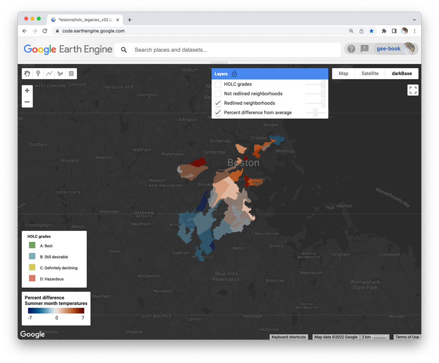

## Revising HOLC script  

### Diagram workflow  

_Draw workflow for part 2 of the HOLC problem and discuss._  

### Review the script  

[HOLC script](../scripts/HOLC_legacies_v1.js)  

### Review HOLC app  

[HOLC app](https://jhowarth.users.earthengine.app/view/eeprimer-holc-legacies)

### Revise HOLC script

#### Filter by attribute

Add this script to print out all instances of a class

```js
print(ee.List(holc.aggregate_array('city'))
    .distinct()
    .sort()
    );
```

Use the list to choose a city to study, then adapt your script so that you select the city by attribute (rather than by overlap with poi).

Delete the poi and correct any dependencies.  

#### Calculate percent difference  

Rather than calculating the difference between the part and whole, please calculate the _percent difference_:  (part - whole) / whole * 100.   

#### Mask with HOLC zones  

Create one layer that only shows summer lst differences in redlined HOLC zones.  

Create a second layer that only shows summer lst differences in non-redlined HOLC zones.  

Draw these two layers on top of the difference layer and show the difference layer at 0.5 opacity.  

   

#### Average difference in redlined zones  

Compute the average difference of all redlined zones in the city from all HOLC zones in the city.  

This will require three steps:  

1. Create a redline zone cookie cutter from the HOLC feature collection that you have filtered for your city.  

2. Derive the mean percent difference of the redline zone.  

3. Print the answer to Console by adapting this code:  

```js
print(redline_mean.first().get('mean'));  
```  

### Interpret errors  

Why does our computation for LST percent differences in Boston differ from the once shown in the HOLC app?

What single line can you change in the script to improve the match between our calculation and the one reported in the app?  

### Explore legacies in US cities  

Use the script to explore _five_ cities in the US that are not featured in the HOLC app.  

Which of the five cities has the strongest racist legacy embedded in summer land surface temperatures?  

Which of the five cities has the weakest legacy?  
