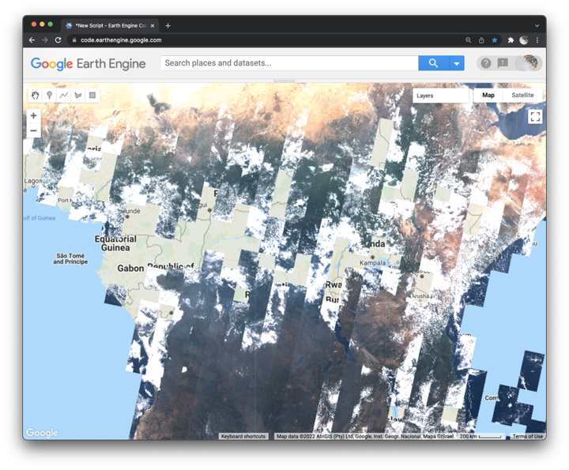

## Image collections  

In this lesson, we investigate how to work with image collections in Earth Engine. You learn how to load an image collection, select the first image in the stack, and filter the collection by time and location. We use the Landsat 8 collection to demonstrate these methods. You see how many days it takes the satellite to image our planet's entire surface and how many times the same location has been imaged over the satellite's mission. We also learn how to reduce an image collection to an image with local operations.  

  

_Figure 1. Landsat 8 scenes collected between June 9 - 25, 2014 for equatorial Africa._  

### Start a new script

```js
//  ~~~~~~~~~~~~~~~~~~~~~~~~~~~~~~~~~~~~~~~~~~~~~~~~~~~~~~~~~~~~~~~~~~~~~~~
//  Title:        Image collections
//  Author:       Jeff Howarth
//  Last edited:  1/11/2022   
// ~~~~~~~~~~~~~~~~~~~~~~~~~~~~~~~~~~~~~~~~~~~~~~~~~~~~~~~~~~~~~~~~~~~~~~~

/*  In this lesson, we investigate how to work with image collections
    in Earth Engine. You will learn how to load an image collection,
    select the first image in the stack, and filter the collection by
    time and location. We use the Landsat 8 collection to demonstrate
    these methods. We see how many days it takes the satellite to image
    the planet's entire surface and how many times the same location has
    been imaged over the satellite's mission. We also learn how to reduce
    an image collection to an image with math operations. */   
```

### Import Landsat 8 image collection  

```js
var L8 = ee.ImageCollection("LANDSAT/LC08/C01/T1_RT")
  // .filterBounds(geometry)                             // filter by location  
  // .filterDate('2014-06-09','2014-06-10')     // filter by date range
  // .filter(ee.Filter.lt('CLOUD_COVER', 20))
  // .select('B4','B3','B2')                    // select bands
  // .min()                                     // reduce pixel values [also try .median(), .max(), .mode()]
  ;

// Print the size of the L8 dataset.
// print('The size of L8 is: ', L8.size());
```
<details>
<summary><b>Check your understanding.</b></summary>
<br>
What are the range of dates available for this image collection in the Earth Engine catalog?
</details>  

### Select first image in stack  

```js
// Print the first image in the collection.
print('First image in collection:', L8.first());
```
<details>
<summary><b>Check your understanding.</b></summary>
<br>
Is the first image the earliest image in the collection, or the most recent image, or is the order of images random?
</details>

### Filter by date range  

Please uncomment the line above that filters the image collection by date range. Please also uncomment the line above that selects bands. Then run the code again.  

<details>
<summary><b>Check your understanding.</b></summary>
<br>
<li>Did our date range select images for one day or two days?</li>
<br>
<li>How many images did the Landsat 8 satellite capture in our date range?</li>
</details>

### Add layer to map  

Use the geometry tools to add a point on Mount Kilimanjaro, Tanzania.  

Please write the appropriate code for each prompt below.  

```js
// Center map on Mount Kilimanjaro, Tanzania and a zoom level of 4.

// Set base layer to 'TERRAIN'.

// Add the L8 dataset to the map with display range of 5000 - 15000. Label the layer 'L8 image collection'.

```

<details>
<summary><b>Check your understanding.</b></summary>
<br>
<li>How many days does it take for the Landsat 8 satellite to capture images for every location on the planet's surface?</li>
<br>
<li>Why do you think some images are missing from the L8 collection?</li>
</details>

### Filter by location  

Please do the following:  

1. Uncomment the filter by location line in the image collection import chain.    
2. Change the date range so that you filter for the entire year of 2014.  
3. Please run the script.  

<details>
<summary><b>Check your understanding.</b></summary>
<br>
<li>How many images does the collection contain for this location?</li>  
<br>
Please use the <b>Inspector panel</b> to click on a location and inspect the chart under the <b>Pixels - Series</b> carrot.
<br><br>
<li>What does the chart show?</li>
<br>
<li>What do you think causes the peaks and valleys in the lines?</li>
<br>
</details>

### Filter by image property  

Please uncomment the line that filters by 'CLOUD_COVER' and run the script.

<details>
<summary><b>Check your understanding.</b></summary>
<br>
<li>How many images does the collection contain for this location now? </li>  
<br>
Please use the <b>Inspector panel</b> to click on a location.
<br><br>
<li>Can you still make a chart? How does it differ from the one you made in the last step?</li>
<br>
</details>  

### Reduce collection to an image  

Please uncomment the last line in the first code block, or the .min() line, and then run the script.  

Try replacing .min() with these other reducers: .max(), .median(), .mean(), .mode().  

<details>
<summary><b>Check your understanding.</b></summary>
<br>
<li>Why does <b>.max()</b> make the scene appear all white?</li>
<br>
<li>Why do white patches with colorful noise remain in the scene when we reduce with <b>.mode()</b>.</li>
<br>
<li>Why are .min(), .max(), .median(), and .mode() called <b>local operations</b>?</li>
</details>

### Practice problem  

You can do this individually or with a partner.  

Please start a new script and load the 'LANDSAT/LT05/C02/T1_L2' image collection.  

Please filter the collection so that you have the same image that we used earlier this week. Add the layer to the map as a 321 composite.  

### Further reading
<br>

[Landsat missions: Landsat 8](https://www.usgs.gov/landsat-missions/landsat-8)

[What are the acquisition schedules for the Landsat satellites?](https://www.usgs.gov/faqs/what-are-acquisition-schedules-landsat-satellites)
