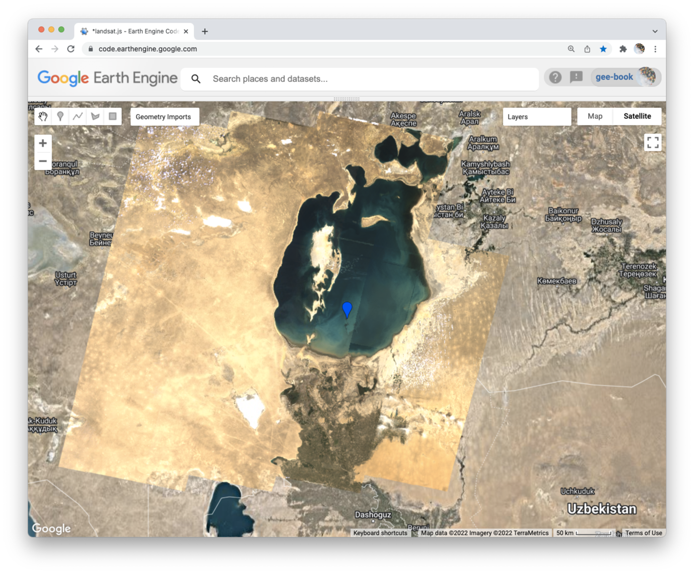

## Landsat collections  

### Purpose  

In this lesson, we explore the Landsat collections that are available through the Earth Engine Data Catalog. After reviewing a little history and getting acquainted with some of the specialist language/jargon associated with Landsat, we will write a script to visualize changes in the Aral Sea over the last 30 years. Working with Surface Reflectance products in Collection Two, we will use a function to scale the data, employ a new method to filter by date, write a custom function to filter different Landsat collections, and examine visible changes in both the landscape and the datasets for studying it.    

### Landsat history  

This is the first image captured by the Multispectral Scanner (MSS), the first digital imaging instrument to be deployed on an earth observation satellite (Landsat 1 launched in 1972).  


Virginia Tower Norwood designed the MSS, as well as the Thematic Mapper (TM) instrument deployed on Landsat 5. For an excellent biography of Norwood and her contributions to remote sensing, please read [this article](https://www.technologyreview.com/2021/06/29/1025732/the-woman-who-brought-us-the-world/).   

  

_Virginia Tower Norwood during her second or third year at MIT. Source: MIT Technology Review_

### Landsat vocabulary  

There are a number of different [Landsat collections](https://developers.google.com/earth-engine/datasets/catalog/landsat) in the Earth Engine Data Catalog. To be able navigate the collection, you should be comfortable with the following vocabulary.  

**Instruments:**   

* __MSS__: Multispectral Scanner  
* __TM__: Thematic Mapper  
* __ETM+__: Enhanced Thematic Mapper  
* __OLI/OLI-2__: Operational Land Imager    
* __TIRS/TIRS-2__: Thermal Infrared Sensor


**Products:**

* __Collection__: there have been two major reprocessing efforts by USGS to improve data quality. [Collection 2](https://www.usgs.gov/landsat-missions/landsat-collection-2) is currently most recent and has best geolocation accuracy which improves time series analyses. _Please note: Earth Engine Catalog will likely not include Collection 1 data in the near future, so please use Collection 2 for all work in this course._   

* __Tiers__: Within a collection, Tier 1 data have highest radiometric and positional quality. USGS recommends using Tier 1 data for all future time-series analysis.  

* __Levels__: Describes the level of data processing applied to products.    

  * [__Level-1__](https://www.usgs.gov/landsat-missions/landsat-level-1-processing-details) includes processing to improve locational accuracy of data.  

  * [__Level-2__](https://www.usgs.gov/landsat-missions/landsat-collection-2-level-2-science-products) products are built from Level 1, but also provide atmospheric correction to create surface reflectance and surface temperature products. Level-2 science products also include spectral indices derived from surface reflectance products.  

  * [__Level-3__](https://www.usgs.gov/landsat-missions/landsat-science-products) products are built from Level-2 products and include Analysis Ready Data (ARD), including Fractional Snow Covered Area and Burned Area, and Scene-based Inputs, including Provisional Actual Evapotranspiration.   

* __Sensor measurements__: what the pixel values represent.  

  * __Raw scenes__: DN (digital number) values represent scaled, calibrated at-sensor radiance.  

  * __Top of atmosphere (TOA)__: calibrated top-of-atmosphere reflectance.  

  * __Surface reflectance__: atmospherically corrected surface reflectance and land surface temperature.     

## Aral Sea study  

To gain some practice working with Landsat collections as evidence for studies of environmental change, we will focus today on the Aral Sea and explore how this water body has changed over the last thirty years.  

  


### Start with a header file  

```js
/*
    TITLE:  Changes in Aral Sea with Landsat  
    AUTHOR: Jeff Howarth  
    UPDATE: 3/1/2022  

    PURPOSE:  In this lesson, we explore the Landsat collections that
    are available through the Earth Engine Data Catalog. After
    reviewing a little history and getting acquainted with some of
    the specialist language/jargon associated with Landsat, we will
    write a script to visualize changes in the Aral Sea over the last
    30 years. Working with Surface Reflectance products in Collection
    Two, we will use a function to scale the data, employ a new method
    to filter by date, write a custom function to filter different Landsat
    collections, and examine visible changes in both the landscape and the
    datasets for studying it.
*/

```

### Load and filter Landsat 4  

Please write a script that does the following:  

```js
// Load L4 collection from 'LANDSAT/LT04/C02/T1_L2'  

// Filter collection by a point on the Aral Sea with a 200 kilometer buffer around the point  

// Filter the collection by the year 1989.  

// Filter the collection by the month range: 8 - 10.  

// Filter the collection for images with less than 30% cloud cover.  

// Apply the scaling factors for SR collections.  

```

### Inspect the result    

```js
// Print the following to console: (1) Collection name and year that was filtered, (2) the size of the collection, (3) all of the images in the collection.   
```

### Create viz parameters  

```js
// Define visualization parameters for the image collection to display a natural color composite.  

```

### Compose map  

```js
// Center the map on the geometry point and zoom level 7.  

// Change the base layer to 'HYBRID'.  

// Add the L4 image from 1989 with a median reducer.    

```

### Write a custom function  

```js
// Write a custom function that: (1) loads and filters the image collection with Image ID and year as arguments and (2) prints the name, size, and contents to the Console.  
```

### Test the function  

```js
// Test the function with the L4 collection and 1989 year filter.  

// Add the test layer to the map as a natural color composite.  
```

### Create a time series  

Create an image at five year intervals (1989, 1994, 1999, etc).  Use the best Landsat source for each image.  Add each layer to the map, but set the default visibility to be 'not shown' for each layer.  

### Examine results  

Please discuss these questions with a partner:  

1. When did the sea split into two?  
2. When two satellites provide coverage, how did you pick between them?  
3. How does Landsat 7 differ from other Landsat satellites?
4. How does Landsat 8 differ from other Landsat satellites?


### Post script: Landsat 9  

Landsat 9 launched on September 27, 2021. It is so new that it is not even listed in the data catalog yet, but we can access the data with the code below.   

```js

var L9 = ee.ImageCollection('LANDSAT/LC09/C02/T1_L2')
  .filterBounds(geometry)
  .filter(ee.Filter.lt('CLOUD_COVER', 20));


print(L9);


// Applies scaling factors.
function applyScaleFactors(image) {
  var opticalBands = image.select('SR_B.').multiply(0.0000275).add(-0.2);
  var thermalBands = image.select('ST_B.*').multiply(0.00341802).add(149.0);
  return image.addBands(opticalBands, null, true)
              .addBands(thermalBands, null, true);
}

var L9_scaled = L9.map(applyScaleFactors);

var L9_viz = {
  bands: ['SR_B4', 'SR_B3', 'SR_B2'],
  min: 0,
  max: 0.3
};

Map.centerObject(geometry,11);
Map.addLayer(L9_scaled, L9_viz, 'L9');

```
