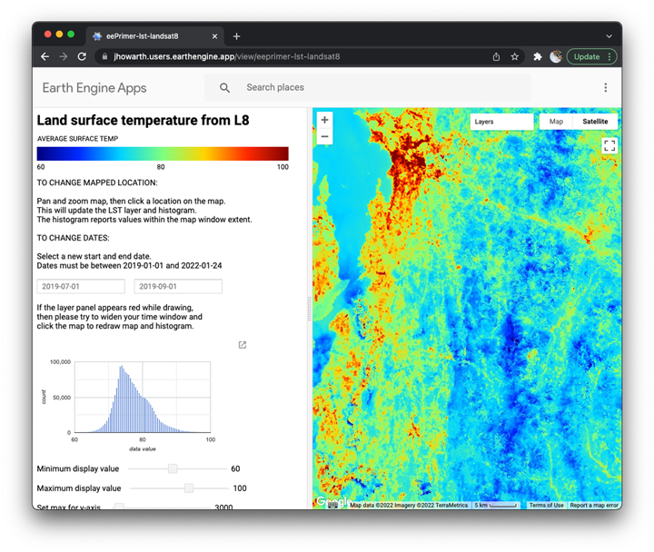
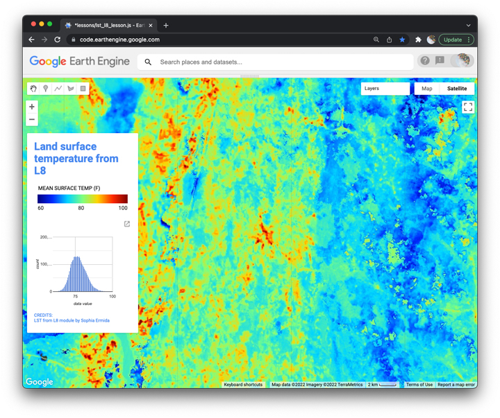

## Land surface temperature at local scales  

In this lesson, we explore high-resolution maps of land surface temperature (LST). You first interpret LST patterns around Middlebury, Vermont and then compare to analogous places in your home town. In a practicum, you then learn how to estimate LST from Landsat 8 images using modules developed by [Sophia Ermida](https://github.com/sofiaermida) and how to convert the temperature units. To visualize and communicate results, you learn how to access [Earth Engine community palettes](https://github.com/gee-community/ee-palettes) and how to configure and compose a panel for the map title, legend, histogram, and credits.       

#### Explore LST in Middlebury  

To start, please open [this earth engine app](https://jhowarth.users.earthengine.app/view/eeprimer-lst-landsat8).  

>_Discuss LST in Middlebury._

  

_Figure 1. App to explore LST with L8._

#### Explore LST in your home town  

Now use the app to explore LST in your home town.  

> _What patterns in Middlebury are analogous to patterns in your home town?_  

> _How does your home town differ from Middlebury?_

## Practicum    

In this practicum, you learn how to produce the map shown in Figure 2.   

  

_Figure 2. Mapped geography with panel for map marginalia._   

### Header  

```js
/*

  TITLE:   Land surface temperature from Landsat 8
  AUTHOR:  Jeff Howarth
  DATE:    1/23/2022

  Purpose: To make and display high resolution maps of land surface
    temperature from Landsat 9 with modules from Sophia Ermida and
    Gennadii Donchyts.

*/
```

### Estimate land surface temperature from landsat 8  

Source: [Sophia Ermida et al (2020)](https://www.mdpi.com/2072-4292/12/9/1471/htm)  
Repo: [Landsat_SMW_LST](https://github.com/sofiaermida/Landsat_SMW_LST)

```js
// -------------------------------------------------------------------
// Load image collection.
// -------------------------------------------------------------------

// Import module for LST computation from L8.

var LandsatLST = require('users/sofiaermida/landsat_smw_lst:modules/Landsat_LST.js');

// Apply module to produce image collection.  

var image = LandsatLST
  .collection
    (
      'L8',                               // landsat collection
      '2019-07-01',                       // start date  
      '2019-09-01',                       // end date
      Map.getCenter()                     // poi to filter collection
    )
;
```
### Reduce collection and scale image  

```js
// -------------------------------------------------------------------
// Reduce image collection to image and scale.   
// -------------------------------------------------------------------

var convert_k2f = function() {
  return  image                                       // image collection input
  .median()                                           // reduce image collection to image
  .subtract(273.15).multiply(9).divide(5).add(32)     // convert K to F
  ;
};
```
### Configure vis parameters  


**References**  
: [Community palettes](https://github.com/gee-community/ee-palettes)  
: [Color advice](https://www.kennethmoreland.com/color-advice/BadColorMaps.pdf)  
: [Principles for scientific color maps](https://www.fabiocrameri.ch/colourmaps/)  
: [Color oracle](https://colororacle.org/)  

```js
// -------------------------------------------------------------------
// Define viz parameters.  
// -------------------------------------------------------------------

// Import module to access community palette library.  

var palettes = require('users/gena/packages:palettes');

// Define visualization parameters.

var lst_viz = {
  min: 60,                                // min display value.
  max: 100,                               // max display value.
  bands: 'LST',                           // band to display.
  palette: palettes.matplotlib.inferno[7] // palette to stretch.
};

```
### Compose map  

```js

// -------------------------------------------------------------------
// Compose map.   
// -------------------------------------------------------------------

Map.setOptions('HYBRID');

Map.addLayer(
    convert_k2f(image),                   // image
    lst_viz,                              // viz parameters  
    'LST',                                // Layer name  
    true                                  // Make visible
    )
  ;

```
### Configure and compose labels

```js
// -------------------------------------------------------------------
// Compose labels.   
// -------------------------------------------------------------------

// style dictionary for labels

var styles = {                            // Style dictionary for all lettering
  title: {                                // Title style
    fontSize: '24px',
    fontWeight: 'bold',
    color: lst_viz.palette[4]             // Color for lettering from palette
    },
  credits: {                              // Credits style
    fontSize: '10px',   
    whiteSpace: 'pre',                    // This allows newline breaks.
    color: '#999999',                     // Color lettering (font color).                    
    margin: '1px 8px 1px 8px'             // Margin (clockwise from top)
  }
};

// Create labels

var title = ui.Label( {                       // Initialize new label.       
  value: 'Land surface temperature from L8',  // Lettering to display.
  style: styles.title,                        // Apply style dictionary.
  targetUrl: {},                              // Place holder for url link
});

var credits = ui.Label( {
  value: 'CREDITS:\nLST from L8 module by Sophia Ermida',
  style: styles.credit,
  targetUrl: 'https://github.com/sofiaermida/Landsat_SMW_LST'
});

```

### Chart histogram

```js

// -------------------------------------------------------------------
// Chart histogram.     
// -------------------------------------------------------------------

var image_tools = require('users/jhowarth/eePrimer:modules/image_tools.js');

// Add histogram to Map.

var histogram = image_tools
  .makeBoundedHistogram
    (
      ee.Geometry.Rectangle(
        Map.getBounds()),                 //  region (because image is unbounded)
      convert_k2f(image),                 //  use data from this image
      'LST',                              //  select this band
      30,                                 //  use this scale (same as image)
      lst_viz.min,                        //  min value of x-axis
      lst_viz.max,                        //  max value of x-axis
      0,                                  //  min value of y-axis
      200000                              //  max value of y-axis
    )
;

```
### Compose legend

```js

// -------------------------------------------------------------------
// Compose legend.  
// -------------------------------------------------------------------

var cart = require('users/jhowarth/eePrimer:modules/cart.js');

var legend = cart                         // module
  .makeGradientLegend                     // function
    (                
      lst_viz,                            // viz parameters
      'MEAN SURFACE TEMP (F)',            // legend title
      'bottom-left'                       // position on map
    )
;
```

### Configure panel  

```js
// -------------------------------------------------------------------
// Initialize and place side panel.
// -------------------------------------------------------------------

// Initialize side panel.  

var panel = ui.Panel                      // Initialize panel widget.
  (
    {
      widgets:                            // List widgets to add to panel.
        [
          title,
          legend,
          histogram,
          credits
        ],
      layout:
        ui.Panel.Layout.flow('vertical'), // Widgets flow in vertical direction.
      style:    
        {
          width: '250px',                 // Width of panel
          height: '400px',                // Height of panel
          position: 'top-left'            // Position of panel on screen.
        }
    }
);

Map.add(panel);                           // Add panel to the Map UI.

```
