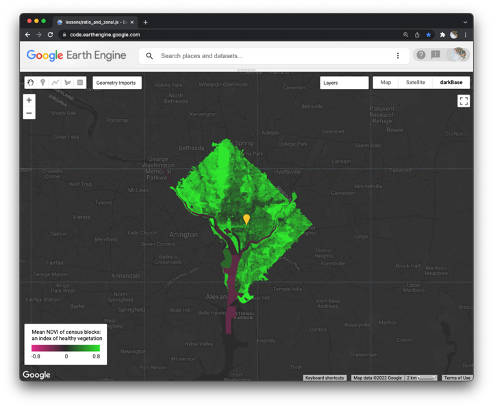

## Band ratios and zonal operations  

In this lesson, you first learn how to compute a BAND RATIO as the normalized difference of two image bands. You use a Sentinel 2 image to compute NDVI and display the results as a map layer with a PALETTE. You then learn how to summarize this continuous data within discrete regions to derive a ZONAL STATISTIC. In order to display the summarized data as a choropleth map (using color to symbolize values of regions), you CONVERT VECTOR TO RASTER and then display the rasterized image. Finally, you construct and place a GRADIENT LEGEND on the map.   


  

_Figure 1. Mean NDVI of census blocks in Washington, DC._  

### Start with a header and modules  

To get started, copy and paste this code block into a blank script and then save the script in your lessons folder.  

```js
// ~~~~~~~~~~~~~~~~~~~~~~~~~~~~~~~~~~~~~~~~~~~~~~~~~~~~~~~~~~~~~~~~~~
/*

  OBJECTIVE: Derive mean NDVI in census blocks for any city in the USA

  FILE:      ratio_and_zonal.js
  AUTHOR:    Jeff Howarth
  DATE:      1/18/2022

  PURPOSE:

  In this lesson, you first learn how to compute a BAND RATIO as the
normalized difference of two image bands. You use a Sentinel 2 image
to compute NDVI and display the results as a map layer with a PALETTE.
You then learn how to summarize this continuous data within discrete
regions to derive a ZONAL STATISTIC. In order to display the summarized
data as a choropleth map (using color to symbolize values of regions),
you CONVERT VECTOR TO RASTER and then display the rasterized image.
Finally, you construct and place a GRADIENT LEGEND on the map.

*/
// ~~~~~~~~~~~~~~~~~~~~~~~~~~~~~~~~~~~~~~~~~~~~~~~~~~~~~~~~~~~~~~~~~~

// --------------------------------------------------------------------
// LOAD modules.
// --------------------------------------------------------------------

var customBase = require('users/jhowarth/eePrimer:modules/darkBase.js');
var cart = require('users/jhowarth/eePrimer:modules/cart.js');
var imageTools = require('users/jhowarth/eePrimer:modules/image_tools.js');

```

### Construct map  

Please use the geometry tool to create a point in Washington, DC. (I put my point on the Capitol building).  

Then copy and paste the code block below into your script and run it.  

```js
// --------------------------------------------------------------------
// CONSTRUCT MAP.
// --------------------------------------------------------------------

// Set base map.
Map.setOptions('darkBase', {'darkBase': customBase.darkBase});

// Center map on point geometry.
Map.centerObject(geometry, 12);

```

<details>
<summary><b>Check your understanding.</b></summary>
<br>
The 'darkBase' layer is not one of the four base layers provided by Google, so where did it come from?
</details>


### Select cookie cutter  

In raster analysis, a **zonal operation** uses the boundaries of one or more features in one layer to summarize the pixel values of a second layer. For some people, it can be helpful to think of an analogy involving cookie cutters and cookie dough. One layer serves as cookie cutters that provide the shapes to cut up a second layer (the dough).  


_Figure 2. Cookie cutters provide the shapes to impress on the dough, always leaving traces of their shapes in the output. Photo source: www.culinaryhill.com_  

>_Diagram how zonal statistic works with a vector cutter and raster dough on the board._  

In this lesson, we want to use a sub-set of the Census blocks feature collection that is available on earth engine as our cookie cutters. We do not want to use all of the Census blocks in the collection, because this would be computationally expensive and very slow. Instead, we want to filter the feature collection to select only the blocks in one county and we want to be able to update (and change) the selected county very easily so that we can easily apply our model to study any city in the country.   

```js
// --------------------------------------------------------------------
// SELECT COOKIE CUTTER.
// --------------------------------------------------------------------

// Import county polygons.
var counties = ee.FeatureCollection("TIGER/2018/Counties")
  .filterBounds(geometry);              // Filter by point geometry.

// Inspect selected county feature.

print('Selected county', counties);

// Import block polygons.
var blocks = ee.FeatureCollection("TIGER/2010/Blocks")
  .filterBounds(counties)               // Filter by selected county.
  ;

// Inspect first block feature.

print('Blocks', blocks.first());

// Display block features in selected county as a map layer.

Map.addLayer(blocks, {color:'gold'}, 'Selected Blocks',0);

```

<details>
<summary><b>Check your understanding.</b></summary>
<br>
Why did we not just select the blocks with the point and skip the step of selecting the county first?  
<br>
</details>

### Make the dough  

There are a number of new things happening in this step so we will break it down into two main chunks.  

First, we load a Sentinel 2 MSI image collection, process it (filter, reduce, scale), and then **clip** the image with our cutters.  
```js

// --------------------------------------------------------------------
// MAKE THE DOUGH.
// --------------------------------------------------------------------

// Load image.

var S2 = ee                                                 // Class of object
  .ImageCollection("COPERNICUS/S2_SR")                      // function of class
    .filterBounds(geometry)                                 // FILTER by location
    .filter(ee.Filter.calendarRange(6,6,'month'))           // FILTER by calendar
    .filter(ee.Filter.lt('CLOUDY_PIXEL_PERCENTAGE', 20))    // FILTER by cloud cover
    .median()                                               // REDUCE to median value
    .divide(10000)                                          // SCALE by /10000
    .clip(blocks)                                           // CLIP by blocks
;

// Inspect selected S2 image.

print('Selected S2', S2);

// Define visualization parameters for natural composite.

var nc_s2_viz = {
  min:0,
  max:0.3,
  bands:['B4', 'B3', 'B2']
};

// Display selected S2 as natural color composite

Map.addLayer(S2, nc_s2_viz, 'Selected S2',0);

```

<details>
<summary><b>Check your understanding.</b></summary>
<br>
<li>What did the <b>clip</b> function do?</li>  
<br>
<li>What are the computational costs of clipping the image (why should you use this function cautiously)?</li>
</details>
<br>

Next, we derive the [normalized difference of vegetation index (NDVI)](https://earthobservatory.nasa.gov/features/MeasuringVegetation/measuring_vegetation_2.php) using the near-infrared and red bands.  

>_Write NDVI equation on board and discuss three situations: (1) NIR = 100 and R = 0, (2) NIR = 0 and R = 100, (3) NIR = 100 and R = 100._

>_Plot the spectral signatures of healthy vegetation versus water with the [spectral signature app](https://jhowarth.users.earthengine.app/view/spectral-signatures). Compare reflectance of the near-infrared and red bands within and between each surface type._   

```js

// Derive NDVI from S2.

var ndvi = S2.normalizedDifference(['B8','B4']);

// Define visualization parameters for NDVI.

var ndvi_viz = {
  min: -0.8,
  max: 0.8,
  palette: ['#E62E8A', '#2B2B2B', '#2EE62E']
};

// Display NDVI with a color ramp.

Map.addLayer(ndvi, ndvi_viz, 'NDVI',0);

```

<details>
<summary><b>Check your understanding.</b></summary>
<br>
<li>Does a normalized difference ratio always involve these two bands?</li>  
<br>
<li>How does earth engine know which band to display as a map layer?</li>  
<br>
<li>How did we choose and define the colors used in the palette?</li>
</details>
<br>

### Cut the dough    

In this step, we compute a summary statistic of the NDVI pixel values (dough) within each block feature (cutters) and then display the result as a map layer. This involves a few new things, so we will again break it into two chunks.  

First, we derive the mean NDVI within each block (a zonal statistic).

```js
// --------------------------------------------------------------------
// CUT THE DOUGH.
// --------------------------------------------------------------------

// Derive mean NDVI within each census block.

var zonalStat = ndvi                  // create output from ndvi input (dough)
  .reduceRegions({                    // compute a zonal statistic
    collection: blocks,               // cookie cutters (regions for statistic)
    reducer: ee.Reducer.mean(),       // statistic (of dough in cutter)
    scale:10                          // if possible, same as dough
  }
);

// Inspect output of zonal statistic.

print('Output of zonal statistic', zonalStat);

```
<details>
<summary><b>Check your understanding.</b></summary>
<br>
<li>Where do you find the zonal statistic in the output?</li>
<br>
<li>How would you alter the script to derive a different zonal statistic, such as the median, minimum, or maximum value?
</details>
<br>

Next, we need to convert a feature collection into an image. We will use values of a feature property in the collection to populate the values of pixels in the image. This step is necessary because earth engine is currently not able to represent feature properties with colors on a map layer. In other words, earth engine can not make **choropleth** maps with vector data, so you must convert vectors to rasters and then display the pixel values with a palette.  

```js

// Convert feature collection into an image.

var zonalStatImage = imageTools       // module
  .makeImageFromFeatures(             // function
    zonalStat,                        // feature collection  
    'mean'                            // property of fc to use as pixel values
  )
;

// Inspect output of vector - raster conversion.

print('Image converted from feature collection', zonalStatImage);

// Display zonal statistic image output with NDVI color ramp.

Map.addLayer(zonalStatImage, ndvi_viz, 'Mean NDVI in blocks');
```
<details>
<summary><b>Check your understanding.</b></summary>
<br>
<li>How do you find the property name to populate the pixel values?</li>
<br>
<li>When converting the output of a zonal statistic to a raster, what determines the name of the property you should use to populate the pixel values?</li>
</details>
<br>

### Compose map marginalia  

This last step aims to help people read and understand your results by providing them a **key** (also called a legend) that defines what the colors of a layer represent. This map element should be accessible if people need it but should also sit quietly on the map margins and not dominate the visual presentation.    

```js
// --------------------------------------------------------------------
// COMPOSE MAP MARGINALIA.
// --------------------------------------------------------------------

// Construct legend  

var legend = cart                                                     // module
  .makeGradientLegend(                                                // function
    ndvi_viz,                                                         // viz parameters
    'Mean NDVI of census blocks:\nan index of green vegetation',    // legend title
    'bottom-left'                                                     // position on map
  )
;

// Place legend on map.  

Map.add(legend);
```

<details>
<summary><b>Check your understanding.</b></summary>
<br>
<li>What should you consider when writing a title for a key?
</details>
<br>


> _Discuss results..._
