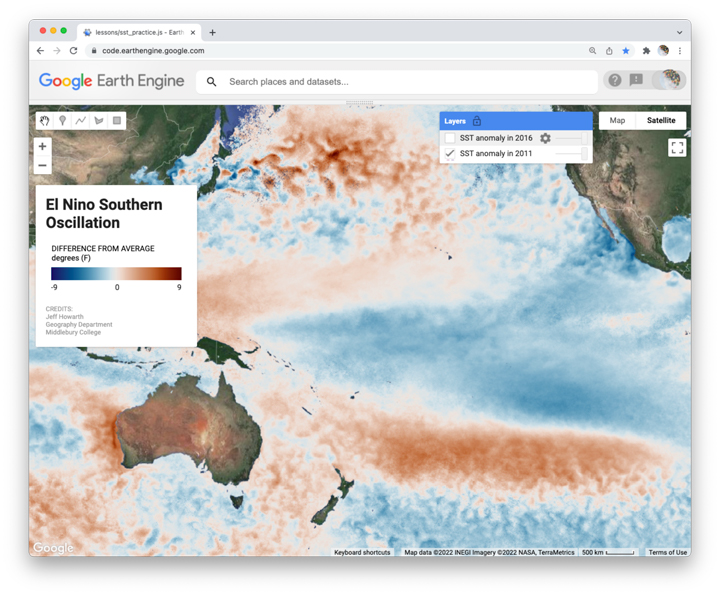
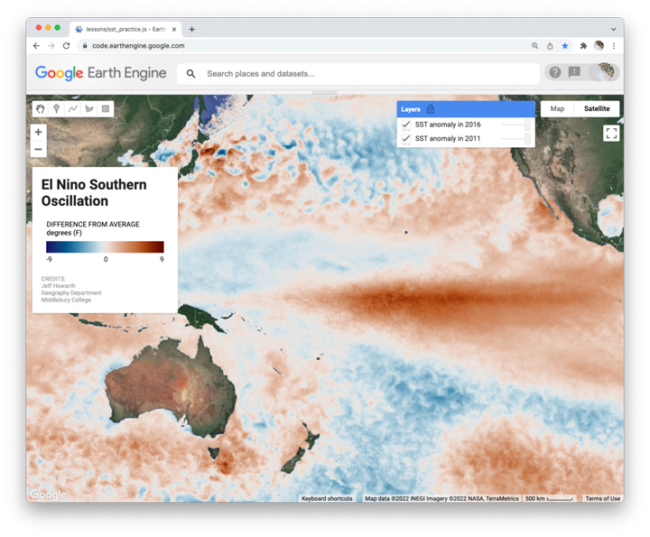

## El Nino Southern Oscillation  

Please try to make this map:

  

The map shows two layers: one layer shows El Nino conditions, the other shows La Nina conditions.  

Both layers average sea surface temperature data from MODIS-Aqua ("NASA/OCEANDATA/MODIS-Aqua/L3SMI") for the months January and February. One layer compares the average for these months in 2011 to the long-term average. The other compares the average for the same months in 2016 to the long-term average.  

The map is centered on:  
- Latitude = 0
- Longitude = -180
- Zoom level = 3  

The base layer is set as 'HYBRID'.  

### Background info on ENSO

  

Image credit: [NOAA](https://www.climate.gov/enso)

Image credit: [Jan Null](https://ggweather.com/enso/oni.htm)  
