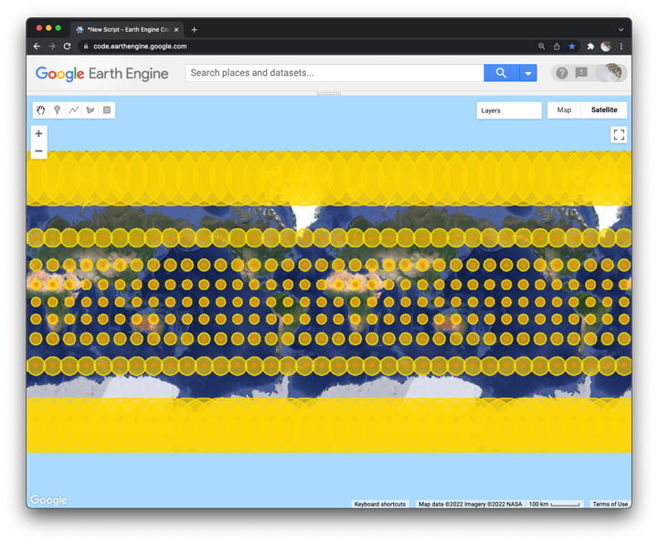

## Tissot's indicatrix



This lesson shows you how to draw [Tissot's indicatrix](https://en.wikipedia.org/wiki/Tissot%27s_indicatrix) with the Code Editor to visualize geometric distortions caused by the Mercator projection. In the process, we will also learn how to efficiently apply a function over a large collection of objects.  

### Construct a new point object  

Start by constructing a point object at the intersection of the equator and the prime meridian and then add the point to the map as a layer.

```js
var point = ee.Geometry.Point([0,0]);

print(point);

Map.addLayer(point, {color:'blue'}, 'First point');
```

<details>
<summary><b>Check your understanding</b></summary>
<br>
<li>What is the Prime Meridian?</li>
</details>  

### Buffer the point  

Now draw a buffer around the point.

```js
var point_buffer = point.buffer(600000);

print('buffer', point_buffer);

Map.addLayer(point_buffer, {color: 'white'}, 'First buffer');
```

<details>
<summary><b>Check your understanding</b></summary>
<br>
<li>What does 600000 represent?</li>
<br>
<li>What are the units?</li>
</details>  

### Generate point grid  

Use a module to access a function that will generate a grid of points spaced 20 degrees apart.

```js
var tissot = require('users/jhowarth/eePrimer:modules/tissot.js');

var grid_points = tissot.grid;

print('grid points', grid_points);

Map.addLayer(grid_points, {color: 'red'}, 'Grid points');
```

<details>
<summary><b>Check your understanding</b></summary>
<br>
<li>What type of object is grid_points?</li>
</details>

### Write a function  

Our goal here is to buffer every point in the grid, but without having to write 162 lines of code.  

In general, when we need to perform the same method to every object in a collection, we can write a function and then __map the function__ over the collection.

The first step is to write a function to buffer features:     

```js
var make_buffers = function(point) {
  return point.buffer(600000);
};
```
<details>
<summary><b>Check your understanding</b></summary>
<br>
Try to fill in the blanks of this sentence:
<br><br>
<li>The ____________ variable is a function; for each ______________ in the collection it __________________.</li>
</details>

### Map function over a collection  

To apply the function to every feature in a feature collection, we use the map method like this:

```js
var tissot_indicatrix = grid_points.map(make_buffers);

print("Tissot's Indicatrix", tissot_indicatrix);

```

<details>
<summary><b>Check your understanding</b></summary>
<br>
<li>How does the tissot_indicatrix object differ from the grid_points object?</li>
<br>
<li>How does .map differ from Map?</li>
<br>
<li>Why did I use double quotes rather than single quotes to define Tissot's indicatrix as a string object?
</details>

### Add layer to map  

Add the indicatrix to the map as a layer and then change the zoom so that we can see what happens to the circles as they approach the poles.    

```js
Map.addLayer(tissot_indicatrix, {color:'gold'}, 'Indicatrix');

Map.setZoom(1);
Map.setOptions('HYBRID');
```

<details>
<summary><b>Check your understanding</b></summary>
<br>
<li>Compare and contrast how the size versus the shape of the circles change as you move from the equator towards the poles.
</details>

### Further exploration    

https://thetruesize.com/
