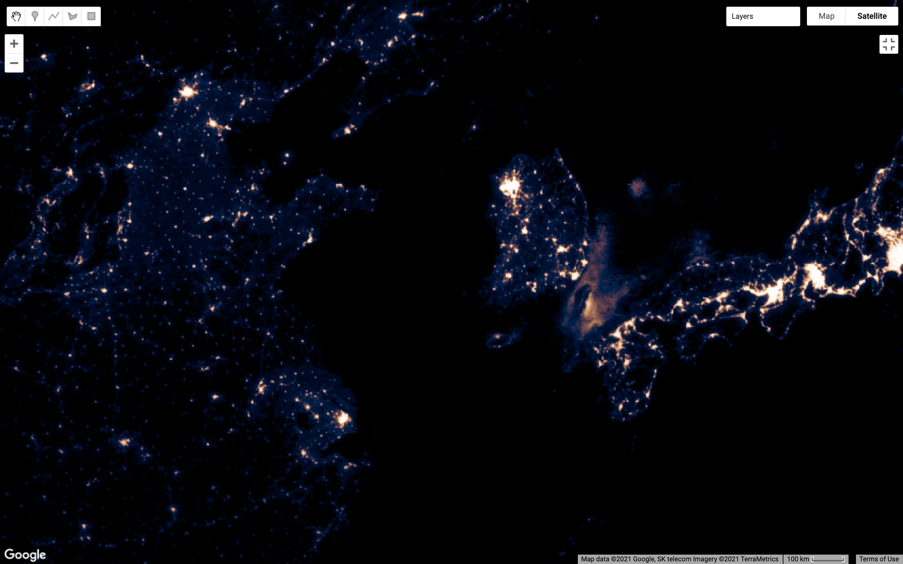

## Introduction  

This chapter introduces core concepts for representing geographic information with a raster data model. We will use Google Earth Engine to work with a dataset of nighttime lights and make the map layer shown below.  



By the end, you should be able to answer these questions:  

1. How does a raster data model represent **attributes of spatial locations**?
2. What is a raster's **spatial resolution and extent**?
3. What is a raster's **temporal resolution and extent**?  
4. How can a raster represent **multiple attributes** for spatial locations at **multiple times**?
5. What is a **data type** versus a **data value**?  
6. What is a **display palette**?  
7. What is **stretch enhancement** and why does it help display data values with colors?

Practically, you will learn how to use the [Earth Engine Code Editor](https://developers.google.com/earth-engine/guides/playground){target=_blank} to:

1. construct an image collection from an address in the Earth Engine data catalog   
2. visualize an image band with a color scheme    

## Import dataset   

In this chapter, we will work with a global dataset of nighttime lights. Our first task is to create a copy of the dataset and give it a name. You will need to open the Code Editor if you have not already done so. Then copy or type the following code into the Code Editor and run the script.

```js
var lights = ee.ImageCollection("NOAA/DMSP-OLS/NIGHTTIME_LIGHTS");    //  import image collection
print("Lights at night dataset", lights);                             //  inspect results
```

The first line gives us a copy of the dataset to work with. Technically, it uses Earth Engine's *ImageCollection* method to create an instance of the dataset (as a _variable_) and assigns the instance a name of our choosing (we called it 'lights'). The method's _argument_ (in parenthesis) calls the asset ID (like a pathname) in the Earth Engine Data Catalog.

The second line prints two things to the **Console panel**: a label and the collection's **metadata** (data about data). Go ahead and inspect the information that you printed to the Console panel. Take note of the key vocabulary terms in bold below:

* The **image collection** consists of a set of **images** (listed as features of the image collection).  
* The image collection and each image has a set of **properties** (some of which are human readable and some of which seem intended for a computer).
* Each image consists of a set of **bands** (the names of which are a little cryptic, but you can follow the **provider_url** in the image collection properties to find descriptions of them).  
* Each band has a name, a **crs** (coordinate reference system), a **data_type**, and **dimensions**.       

If this architecture and vocabulary are new to you, the next section reviews how the **raster data model** works as a general template for storing spatial information.   

## Raster data model         

The raster data model represents spatial information as a grid of values. The position of a value in the grid represents location. Each value represents an attribute of the location.  


The illustration above shows two versions of a raster for a small portion of the nighttime lights dataset. The left-side shows how the computer encodes the data and the right-side shows a scheme that is a bit more readable. On the left, the array holds 8 bit unsigned integers. This **data type** uses eight binary numbers to represent integer **data values** between 0 and 255. The scheme on the right shows a grid with four columns and five rows. Each cell in the grid is called a **pixel** (short for "picture element"). The number of pixels in each row and column define the **dimensions** of the raster.      

As you can see, the raster data model stores one value for each location. Given this simple fact, we should ask: how can we use a raster data model to store more than one attribute for each location? For example, the nighttime lights dataset describe brightness of lights at every location in a raster for more than one year. Furthermore, this dataset also describes a few different categories of brightness for every location in the raster. How does it do this?         

The solution is two-part: use more than one raster and use a hierarchy to organize them. This is where bands and image collections come in. The figure below illustrates EE's raster system that we glimpsed when we inspected the nighttime lights information that we printed to the Console panel.   

* The image collection consists of a set of images.
* Each image in the image collection represents a **different time observation**.
* Each band in an image represents a **different category of attributes**.  

_insert figure for image collection architecture..._

## Visualize data with color  

Our next task is to visualize the data as a map layer. This will involve a few steps:  

1. Define a color palette for visualizing raster values.
2. Define a visualization scheme (how raster values relate to the color palette).  
3. Apply visualization scheme to a raster as a map layer.  

The code below defines a **color palette**.  

```js
//  Create a color palette
var lightsPalette = ['black', '#000b4a', '#5a2c49','#94574e', '#c9875e', '#f4bf87', 'white'];

//  Inspect palette in Console
print('Color palette',lightsPalette);
```

The **palette** is a *list* of HTML colors, and each HTML color is a *string*. (Lists are enclosed in brackets and strings are enclosed in quotation marks.) Our example illustrates two different ways that you can specify colors. First, you can use **HTML color names**, like 'Black' and 'White'. There are 140 different HTML color names that will be recognized by all modern browsers and are safe to use in Earth Engine. Alternatively, you can also define colors with **hexadecimal codes**, which consist of six characters following a pound sign. These allow you to create custom colors as additive combinations of red, green, and blue.

The code below defines a **visualization scheme**.  

```js
//  Create viz scheme  
var lightsViz = {                       //  Name of Viz object  
  min:0,                                //  Value to display with first color in palette
  max: 63,                              //  Value to display with last color in palette
  bands: 'stable_lights',               //  Name of the band with data values  
  palette: lightsPalette                //  Refers to the palette defined previously  
};

//  Inspect viz scheme in Console
print('Viz scheme', lightsViz);
```

The visualization scheme is an *object* (enclosed in curly brackets). The **min** and **max** keys define the data range that we want to display with colors, while the **palette** key references the list of colors we made previously. In this example, we are defining the data range based on the minimum and maximum values that populate the raster. Often, these will be documented as properties of the image collection, but not necessarily for all bands. Alternatively, you can also look in EE's Data Catalog for metadata about the collection. It is often listed under the [Bands tab](https://developers.google.com/earth-engine/datasets/catalog/NOAA_DMSP-OLS_NIGHTTIME_LIGHTS#bands){target=_blank}.

## Stretch enhancement     

Visualization parameters help resolve a common mismatch between the range of values that a raster can store (defined by the raster's **data type**) and the range of values that populate the raster. Often, the range of values that populate a raster is much smaller than the range of values that the data type can represent. This affects our ability to see differences in our data when we visualize raster values with color. **Stretch enhancement** is a method to tune the range of display colors to the range of populated data values in order to improve visual contrast.   

  

The **frequency distribution** above illustrates this for our simple 20 pixel example introduced previously. It shows the number of pixels (y-axis) that populate the raster for each value provided by the data type (x-axis). The eight bit unsigned integer data type can represent all integers between 0 and 255, but our raster contains values over a much smaller range (0 - 48).  

Now consider that the pixel depth will also control the number of colors available to visualize the raster values. In the illustration, the **palette** lists seven discrete colors. These colors seed a **color ramp** that then represents all the potential values provided by the pixel depth. The first color represents 0, the last color represents 255. The other colors are distributed evenly across the middle and transitional colors fill in the gaps. The color ramp appears continuous, but it really just represents 256 steps between black and white that pass through the other five colors at equal intervals.   

The **raw display** simply uses the color ramp to represent all the potential values in the raster as defined by the data type. The result has poor contrast, because we are only using a small part of our color ramp to display our raster values. The **stretched display** solves this by stretching our data range (defined by the minimum and maximum values, or 0 and 48 in this toy example) over the entire color ramp. This improves contrast dramatically, because we are now using our full range of color to represent our full range of populated values.  

## Add map layer  

We apply the visualization scheme when we represent raster values as a **layer** on the map. For example:  

```js
//  Add map layer
Map.addLayer(
  lights,                               //  Name of dataset with values to display as a layer     
  lightsViz,                            //  Name of object with viz parameters
  'Lights at night',                    //  Name for layer as a string  
  1,                                    //  Visibility of layer
  1);                                   //  Opacity of layer
```

This uses the Map's *addLayer* method and takes five arguments (each described with comments).  When you run the code, the Map UI will apply the 'lightsViz' visualization scheme to the 'lights' image collection. Try *clicking the layers button* on the top right of the map window. You should see the layer name ('Lights at night') and a check mark signifying that the layer is being shown. We made the layer opaque, so we can not see the base map underneath it, but you can use the slider to the right of the label to reduce the opacity (making the layer appear more transparent).      

## Practice problems    

Let's review some of the concepts we have touched on thus far. In this section, we will make small changes to the code we have written in an effort to better understand how raster methods work.    

### 1. Color palette

Please alter the _visualization scheme_ by making the _palette_ key and value pair a comment, as shown below. This will tell Earth Engine to ignore this line when you run the script.

```js
var lightsViz = {                       //  Name of Viz object  
  min:0,                                //  Value to display with first color in palette
  max: 63,                              //  Value to display with last color in palette
  bands: 'stable_lights',               //  Name of the band with data values  
//  palette: lightsPalette                //  Refers to the palette defined previously  
};
```

After you have made this change, go ahead and run the script. What looks different about the map layer? How would you describe the palette that Earth Engine uses by default if you do not define one in the visualization scheme?  

### 2. Stretch enhancement     

Please alter the _visualization scheme_ so that the _min_ and _max_ key and value pairs are commented, as shown below. After you have made these changes, please run the script.    

```js
var lightsViz = {                       //  Name of Viz object  
//  min:0,                                //  Value to display with first color in palette
//  max: 63,                              //  Value to display with last color in palette
  bands: 'stable_lights',               //  Name of the band with data values  
  palette: lightsPalette                //  Refers to the palette defined previously  
};
```

How did this change the contrast of your map layer? How does this affect your ability to interpret your data?    

Before moving on, please be sure to undo the changes that you made to the _visualization scheme_ to restore the original palette and stretch enhancement.       

### 3. Layer arguments    

Let's explore the arguments of the _addLayer_ method. Please try to alter the arguments as described below. For each, please describe how the change affects the display of the map layer.    

1. Change the layer name to 'This is the layer name' and run the script.
2. Change the layer visibility to 0 and run the script.    
3. Change visibility to _true_ and run the script.    
4. Change visibility to _false_ and run the script.   
5. Change opacity to 0 and run the script.    
6. Change opacity to true and run the script.

Finally, why do you think the visibility and opacity parameters behave differently?  

Before moving on, please be sure to return the script to the original form described in the _Add map layer_ section above.    
