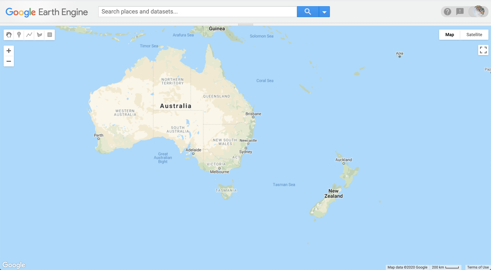

# Problem and Plan

A problem involves having a goal but not knowing how to achieve it. The basic idea is that the desired goal state differs from the present state of things in one or more ways. A solution identifies a way to transform the present state into a goal state.

This is a key idea: _a solution is transformative_. It involves transforming something into something else. So when you start thinking about a problem, you want to identify both where you want to be (your goal state) and where you are starting from (your present state).

Our problem is relatively simple. When we first start the Code Editor, the Map UI looks like this (I've expanded the windows a bit so that the map takes up the whole display):

*Map 1: How the map looks when we start*

We'd like the map to look like this:

*Map 2: How the map looks when we're done*

In our problem, the first map represents our present state and the second map represents our goal state. To solve this problem, we just need to find a way to change the present state so that it looks like the goal state.

## Clicking through a solution

If you have used Google Maps before, or any similar mapping program on your computer, tablet, or smart phone, then you can probably figure out how to solve this problem by clicking icons provided on the Map UI.

You can use the [Code Editor](https://code.earthengine.google.com/) to try this on your own or you can try following along with me in this video:

<figure class="video_container">
  <iframe width='640' height='360' src="https://www.youtube.com/embed/pTGGHXRBvxQ" frameborder="0" allowfullscreen="true"> </iframe>
</figure>  

Solving this problem by clicking is fine if you only need to solve it once, but it would be pretty hard on the wrists if this was a recurring problem and we had to manually click through a solution every time we wanted to change the default map display. As we get deeper into working with Google Earth Engine, you'll likely find that more times than not, you'll want to look somewhere outside of the USA, or show a region in more or less detail than the default display, or show a region with a basemap other than the traditional Google map.

So let's work out how to solve this problem with code.

## Representing the problem

Let's think about what we actually did when we clicked our way through a solution.

The first button I used was the **pan** tool. With the pan tool, when I clicked on the map and moved the mouse, the map appeared to move in the direction that the mouse moved. That effectively lets us move the map so that we could center the map on Australia.

The next button I used was the **zoom** tool. When I clicked the + button, this made the geographic features on the map appear larger and in greater detail. This let me zoom into the harbor at Sydney.

The third button I used was the **basemap selection** tool. This let me swap out the traditional Google Map for the Satellite image.  

I had to go back and forth a bit between these tools, but ultimately, I only changed three things. In other words, for our problem, we can say that the start and goal states have three conditions that differ:

| **Condition** | **Start** | **Goal** |
| :--- | :--- | :--- |
| **Center of map** | Over USA | Over Sydney |
| **Zoom level** | High in sky | Close to surface |
| **Base Map type** | Map | Satellite |

# Planning a solution

Now let's think about how these differences represent transitions between states. What I'm after here is not how one map is different from another, but rather how one map can *become* a different map if we change one thing about it.

We start with this map:

If we just change the map center, we make this map:

Then if we take this map and just change the zoom level, we make this map:

And if we take this map and just change the basemap from Map to Satellite, then we'll end up with this map:

Problem solved!

Planning a solution like this is similar to creating a storyboard. The key is to focus on the transitions, on the spaces between each picture on the board. We want to identify what changes from one picture into the next, as shown in this flow diagram:

This gives us a rough plan. Now we just need to identify methods in Google Earth Engine that will allow us to implement this plan.
