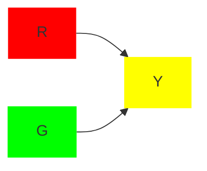

## Introduction  

We see color because light enters our eyes. 

Light often enters our eyes because it reflects off an object's surface. We see color in the textiles of our clothing, the paint on a wall, the ink in a book, the plastic of a bottle. In all these cases, we see color because objects absorb some parts of the visible spectrum and reflect the difference.  

Many people learn how color works by working with one of these materials. As a result, many people think that the primary colors are red, yellow, and blue and secondary colors are made by mixing these primaries: blue and yellow make green, red and yellow make orange, and red and blue make violet. 

This can make the following fact a little confusing: _a computer monitor makes yellow by mixing red and green_. 

This is because computer monitors emit light, rather than reflect it. As a result, computer monitors create color with the __additive color system__. This is a powerful method for visualizing data in images. This page aims to help you better understand how this color system works. 

## Color blindness

Before we continue, we should first understand that not all people see color the same way. For example, about 6% of men will see the graphic above like this:

This is a common form of red-green color blindness called _deuteranopia_. I use a little program called [Color Oracle](https://colororacle.org/){target=_blank} to check how colors that I use on maps will look to people with different forms of color blindness in an effort to make information universally accessible. Using additive color to visualize images, however, challenges goals of universal design and some people may have difficulty reading RGB composites or will need to learn how to read them with additional scaffolding. If you know that you see colors differently, or if the two figures above do not look different to you, please be in contact with me so that we can figure out strategies to make this portion of the course accessible to you. Thank you.  

## First color image

_Tartan Ribbon, by Thomas Sutton and James Clerk Maxwell, 1861_ 

_Tartan Montage, by Celtus, 2008_ 

---

## Additive color system  

In the additive color system, three primary colors (red, green, blue) make three secondary colors (yellow, magenta, and cyan). The absence of all three primaries makes black, while full amounts of the three primaries make white.  

You can recreate these colors and explore other intermediary colors with the RGB mixer below.  

<iframe
  src="https://jhowarth.users.earthengine.app/view/ee-edu-rgb"
  style="width:910px; height:576px;"
></iframe>

---

## RGB Composites

Additive color is a powerful method to visualize pixels values across three rasters all at once. The image below shows an example. The image contains three bands that represent the brightness of nighttime lights in three different years (2013, 2003, 1993). For each band, the image displays brightness value with a different color channel; it shows pixel values in the first band (2013) with red, pixel values in the second band (2003) with green, and pixel values in the third band (1993) with blue. The result is called an __RGB composite__. The order of the bands (1,2,3) determines the colors used to display the band's pixel values (RGB).   

_Change in nighttime lights 1993 - 2013, Shanghai, China_

---

## What are nighttime lights?  

[Night Lights Change in the Middle East](https://earthobservatory.nasa.gov/images/90100/night-lights-change-in-the-middle-east){target=_blank}  

[Old Night Vision Meets New](https://earthobservatory.nasa.gov/images/79846/old-night-vision-meets-new){target=_blank}  

[DMSP OLS](https://eogdata.mines.edu/products/dmsp/){target=_blank}   

[VIIRS Nighttime Lights](https://www.earthdata.nasa.gov/learn/backgrounders/nighttime-lights){target=_blank}

---

## Workflow for image

The diagram below outlines how I used additive color to show changes in the DMSP OLS dataset with Earth Engine.  

---

## Exploring additive color  

You can use the app below to explore this RGB composite and become more familiar with how additive color works as a method for visualizing geographic change.   

<iframe
  src="https://jhowarth.users.earthengine.app/view/rgb-nighttime-lights"
  style="width:854px; height:480px"
></iframe>

[_Link to app_](https://jhowarth.users.earthengine.app/view/rgb-nighttime-lights){target=_blank}  

---

## Temporal scale and change 

You can also use the app to think a little about how the temporal scale of the change image may influence the kinds of change that you can see.   

| Temporal Concepts           | Changes in the Night image            |
| :---                        | :--                                   |   
| Value                       | Average brightness of stable lights   |
| Resolution                  | 1 year                                |
| Interval                    | 10 years                              |
| Extent                      | 20 years                              |

  

What do the different visual patterns (Holiday Lights, Aurora, Heat, and Red Giant) tell you about the temporal characteristics of the physical changes to the Earth's surface?

---

 This work is licensed under a <a rel="license" href="http://creativecommons.org/licenses/by-nc-nd/4.0/">Creative Commons Attribution-NonCommercial-NoDerivs 4.0 International License</a>.
