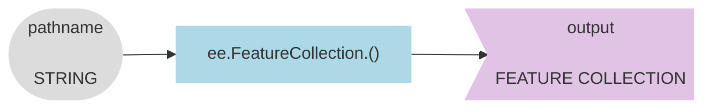
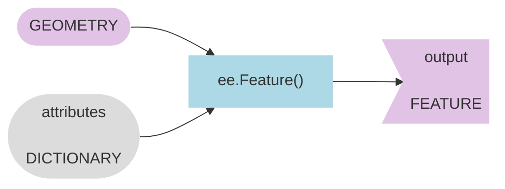
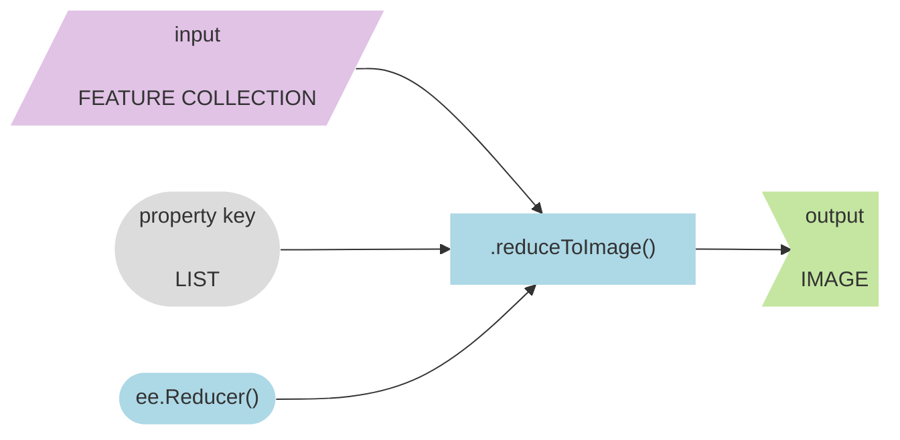

## Introduction 

The videos below introduce geometry and feature objects in Google Earth Engine. They walk you through how to import a table as an asset, how to construct a feature from scratch in the Code Editor, and how to convert vector into raster in Earth Engine.  

---

## Start a new script  

<iframe width="720" height="405" src="https://www.youtube.com/embed/-c-l-s1wnG8?si=9wS04bnlPLH1Ewht" title="YouTube video player" frameborder="0" allow="accelerometer; autoplay; clipboard-write; encrypted-media; gyroscope; picture-in-picture; web-share" allowfullscreen></iframe>

```js
// ~~~~~~~~~~~~~~~~~~~~~~~~~~~~~~~~~~~~~~~~~~~~~~~~~~~~~~~~~~~~~~~~~~~~~~~~~~
//  Hello Feature Collection
//
//  Jeff Howarth 
//  Geography 251
//
//  Oct 1, 2023
// ~~~~~~~~~~~~~~~~~~~~~~~~~~~~~~~~~~~~~~~~~~~~~~~~~~~~~~~~~~~~~~~~~~~~~~~~~~

```

---

## Import a table as an Asset

<iframe width="720" height="405" src="https://www.youtube.com/embed/5Q0ll_qkPVs?si=4fH24him5ajy10ug" title="YouTube video player" frameborder="0" allow="accelerometer; autoplay; clipboard-write; encrypted-media; gyroscope; picture-in-picture; web-share" allowfullscreen></iframe>

---

## Load Feature Collection from String



<iframe width="720" height="405" src="https://www.youtube.com/embed/BtC1QSO2-_I?si=WpHHLPzTmbhkfKeE" title="YouTube video player" frameborder="0" allow="accelerometer; autoplay; clipboard-write; encrypted-media; gyroscope; picture-in-picture; web-share" allowfullscreen></iframe>

```js
// --------------------------------------------------------------------------
//  Load Feature Collection from String (collection name). 
//
//  Updated: 9/30/23
// --------------------------------------------------------------------------

var hello_pond ;

print(
  'HELLO FEATURE COLLECTION:',
  hello_pond,
  hello_pond.size(),
  hello_pond.first()
  )
;
```

---

## Center map on Object

<iframe width="720" height="405" src="https://www.youtube.com/embed/h3UvN4i9IDI?si=p1RbSh6ZZeOvCsav" title="YouTube video player" frameborder="0" allow="accelerometer; autoplay; clipboard-write; encrypted-media; gyroscope; picture-in-picture; web-share" allowfullscreen></iframe>

```js
// --------------------------------------------------------------------------
//  Center Map on Object.
//
//  Updated: 9/30/23
// -------------------------------------------------------------------------- 
 
Map.centerObject();
Map.setOptions();
```

---

## Add Feature Collection as Map Layer

<iframe width="560" height="315" src="https://www.youtube.com/embed/4oq8vGiKmOk?si=wrMb7nwLbGVx6Q8N" title="YouTube video player" frameborder="0" allow="accelerometer; autoplay; clipboard-write; encrypted-media; gyroscope; picture-in-picture; web-share" allowfullscreen></iframe>

```js
// --------------------------------------------------------------------------
//  Add Feature Collection as Map Layer.
//
//  Updated: 9/30/23
// --------------------------------------------------------------------------
  
Map.addLayer();
```

---

## Create a geometry  

<iframe width="560" height="315" src="https://www.youtube.com/embed/clBmMnhcfZU?si=KrY5AMQz3y3TBgSx" title="YouTube video player" frameborder="0" allow="accelerometer; autoplay; clipboard-write; encrypted-media; gyroscope; picture-in-picture; web-share" allowfullscreen></iframe>

```js
// --------------------------------------------------------------------------
//  Create a Geometry.
//
//  Updated: 9/30/23
// --------------------------------------------------------------------------

print(
 'Pond Geometry:',
  geometry
  )
;
```

---

## Construct a feature



<iframe width="720" height="405" src="https://www.youtube.com/embed/W3035QKNPkw?si=Nue5AiaEI0IGrTiw" title="YouTube video player" frameborder="0" allow="accelerometer; autoplay; clipboard-write; encrypted-media; gyroscope; picture-in-picture; web-share" allowfullscreen></iframe>

```js
// --------------------------------------------------------------------------
//  Construct a Feature.
//
//  Updated: 9/30/23
// --------------------------------------------------------------------------
 
 var pond_attributes ;
 
 var pond_feature ;
 
 print(
   "HELLO POND FEATURE:",
   "geometry:", geometry,
   "attributes:", pond_attributes,
   "feature:", pond_feature
   )
  ;
 
 Map.addLayer();
```

---

## Convert feature collection into an image



<iframe width="720" height="405" src="https://www.youtube.com/embed/5As-FO7NfQ8?si=8qoRMY-VlkJPdx-I" title="YouTube video player" frameborder="0" allow="accelerometer; autoplay; clipboard-write; encrypted-media; gyroscope; picture-in-picture; web-share" allowfullscreen></iframe>

```js
// ---------------------------------------------------------------------------
//  Convert feature collection into an image. 
//
//  Updated: 10/01/23
// ---------------------------------------------------------------------------

var pond_image ;

print(
  "HELLO POND IMAGE:", 
  pond_image
  )
;

Map.addLayer();
```

---

<a rel="license" href="http://creativecommons.org/licenses/by-nc-nd/4.0/"></a><br />This work is licensed under a <a rel="license" href="http://creativecommons.org/licenses/by-nc-nd/4.0/">Creative Commons Attribution-NonCommercial-NoDerivs 4.0 International License</a>.