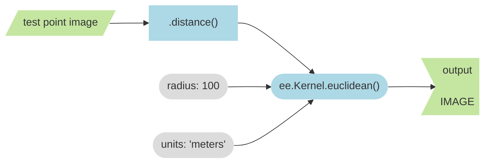
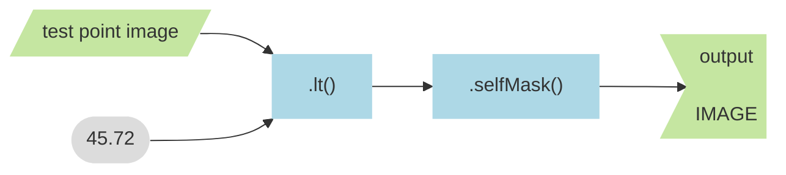
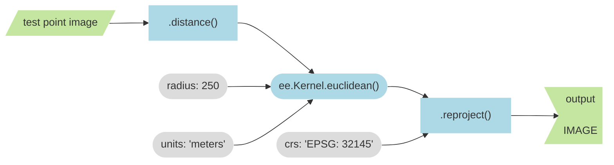

_INCOMPLETE DRAFT_  
_October 5, 2023_

## Introduction

I find working with distance methods on raster datasets in Earth Engine to be a little confusing, so I made the app below to better understand how these things work. The text below walks you through how to make sense of it. 

<iframe
  src="https://ee-edu-apps.projects.earthengine.app/view/ee-edu-distance"
  style="width:854px; height:480px"
></iframe>

## Test point feature collection    

You should see a yellow point on the 50 yard line of Youngman Field. If you click on the __Layers widget__, you should see a list of layers that you can add to the map. When you first load the embedded app, the layer at the bottom should be the only one checked; this is the layer with the little yellow dot, called __Test point (Feature Collection)__ because it is a feature collection with one feature in it.  

## Test point image  

The next layer up from the bottom is called  __Test Point Image__. It is the same point at midfield, but now is is stored as a binary image. The little white pixel in the center marks the location of the test point; this pixel has a value of 1. All the black pixels have a value of 0.  

If you zoom out a little (by clicking the - button on the upper left), you should see the extent of the image. There is an edge to the raster beyond which you can see the underlying satellite base map. The extent is 300 meters by 300 meters.  

## Simple distance image   

Still moving from bottom up in the layer panel, the next layer is called __Simple Test Distance Image__ and represents the distance from the test point image. The figure below shows how I made it.



Notice that the .distance() method takes the ee.Kernel.euclidian() method as an argument. (I use blue to indicate methods and rounded shapes to indicate arguments, or things that get put into a method's parentheses). 

A __kernel__ is an analysis window. In this case, the kernel defines the spatial extent of the euclidean distance operation. When we say that we want the radius of the kernel to be 100 meters, we are defining the size of our analysis window. This is a little confusing, because I think Earth Engine actually uses a square as the kernel shape, not a circle, but more on that later.  

In this case, the extent of the Simple Test Distance Image represents the __kernel extent__; it shows the size of the window that was centered on the only pixel in the binary image with a non-zero value. Within this kernel window, Earth Engine computed the Euclidean distance from the single non-zero pixel to all the other zero pixels in the kernel extent.

The fact that the extent of the Simple Test Distance Image is smaller than the extent of the Test Point Image also tells us something important. Remember that the Test Point Image was the input to the distance method (I use the parallelogram shape to represent data inputs because I am trying to suggest they are moving or about to undergo change). So the difference between the two extents means that the .distance() method does not make computations across the entire extent of the input image. If it did, the extent of the output would be the same as the input. Instead, the .distance() method computes distance within the extent of the kernel that you feed it. Any locations outside of the kernel extent get masked. 

## Simple distance threshold 

You may have noticed that if you zoom out too far when looking at the test point image extent in the previous section, Earth Engine stops drawing the Simple Test Distance Image on the map. That is perhaps the first clue that something is weird here. 

_Why would the ability to draw the layer depend on the zoom level?_ 

If this fuels a sense of doubt and you begin to wonder how much you should trust what the layer claims to show you, I would like to double-down on such concerns by looking at the next layer, called __Threshold Simple Distance at 50 Yards__. Here is how I made it:  



The output is a binary image, where all locations that are 50 yards (45.72 meters) or less from the midfield point are displayed in white and all other locations are masked. If you turn off all the other layers, you should be able to see the satellite base layer and compare this circle to hatch marks on the football field. The circle should reach the goal line, but it does not. It seems instead to leave a long field goal.      

_Why does this distance layer under represent distance?_  

There are two things that help understand why this happens when we use the Code Editor: 

1. Pixel scale changes with zoom level.   
2. Zoom level determines analysis scale, unless we specify otherwise. 

Google Earth Engine stores all image assets in a stack of different resolutions defined by zoom level. The idea is that each zoom level serves you an image with the same number of pixels. As a result, pixel scale changes as you move between zoom levels. Here is another way to think about this: you do not get more pixels on your monitor to see more detail, you simply get pixels that represent smaller distances on the Earth's surface.     


_source:_ [_Google_][google]{target=_blank}

The image above shows how each pixel generalizes the values of a 2x2 block of pixels at the next, more detailed zoom level. As a result, pixel scale resembles a _pyramid_ as you move from small scale to large scale zoom levels. 

When you use a kernel method in the Code Editor, the zoom level of the map in the Code Editor determines the scale of the analysis. That is why the results appear to change as you zoom in and out; by changing the zoom level, you change the scale of the analysis. 

[google]: https://developers.google.com/earth-engine/guides/scale


## Distance image with .reproject(crs)

_To be continued..._




## Source code  

```js
// ~~~~~~~~~~~~~~~~~~~~~~~~~~~~~~~~~~~~~~~~~~~~~~~~~~~~~~~~~~~~~~~~~~~~~~~~~~~~~
//  On distance in Earth Engine
//
//  Jeff Howarth
//
//  Updated: Oct 5, 2023
// ~~~~~~~~~~~~~~~~~~~~~~~~~~~~~~~~~~~~~~~~~~~~~~~~~~~~~~~~~~~~~~~~~~~~~~~~~~~~~

// -----------------------------------------------------------------------------
// Make test point at 50 yard line.
// -----------------------------------------------------------------------------

var test_point1 = ee.Geometry.Point([-73.17965925111653, 44.00167387729651]);

Map.centerObject(test_point1, 17);
Map.setOptions('HYBRID');

// Map.addLayer(test_point, {color: 'red'}, "Test Point", false);

// -----------------------------------------------------------------------------
// Put test point in a feature collection.
// -----------------------------------------------------------------------------

var test_fc = ee.FeatureCollection(
  [
    ee.Feature(test_point1, {'tag': 1}),
  ]
);

Map.addLayer(test_fc, {color: 'Yellow'}, "Test point (Feature Collection)");

// -----------------------------------------------------------------------------
// Define an abitrary test extent.
// -----------------------------------------------------------------------------

var test_extent = test_point1.buffer(150).bounds();

// -----------------------------------------------------------------------------
// Convert point to an image.
// -----------------------------------------------------------------------------

var crs = "EPSG: 32145";

var test_image = ee.FeatureCollection(test_fc)
  .reduceToImage(["tag"], ee.Reducer.max())
  .reproject({crs: crs})
  .unmask()
  .rename("test_image")
  .clip(test_extent)
;

print("test image", test_image, test_image.projection());

Map.addLayer(test_image, {min:0, max:1}, "Test point Image", false);

// -----------------------------------------------------------------------------
// Make test distance image without .reproject(crs).
// -----------------------------------------------------------------------------

var kernel_radius = ee.Number(100);

var test_distance_image_without_crs = test_image
  .distance(ee.Kernel.euclidean({radius: kernel_radius, units: 'meters'}))
  // .reproject({crs: crs})                                         
  .rename('distance')
  ;

print("test distance image:", test_distance_image_without_crs, test_distance_image_without_crs.projection());

var inferno = ["#000004", "#320A5A", "#781B6C", "#BB3654", "#EC6824", "#FBB41A", "#FCFFA4"].reverse();

Map.addLayer(test_distance_image_without_crs,  {min:0, max: 100, palette: inferno}, "Simple Test Distance Image", false);

// -----------------------------------------------------------------------------
// Threshold distance image without crs at 50 yards. 
// -----------------------------------------------------------------------------

var test_image_buffer_without_crs = test_distance_image_without_crs.lt(45.72).selfMask();

Map.addLayer(test_image_buffer_without_crs, {min:0, max:1}, 'Threshold Simple Distance at 50 Yards', false);


// -----------------------------------------------------------------------------
// Make test distance image with .reproject(crs).
// -----------------------------------------------------------------------------

var test_distance_image_with_crs = test_image
  .distance(ee.Kernel.euclidean({radius: 100, units: 'meters'}))
  .reproject({crs: crs})                                         
  .rename('distance')
  ;

print("test distance image:", test_distance_image_with_crs, test_distance_image_with_crs.projection());

var inferno = ["#000004", "#320A5A", "#781B6C", "#BB3654", "#EC6824", "#FBB41A", "#FCFFA4"].reverse();

Map.addLayer(test_distance_image_with_crs,  {min:0, max: 100, palette: inferno}, "Test Distance Image with Reproject", false);

// -----------------------------------------------------------------------------
// Threshold distance image with crs at 50 yards. 
// -----------------------------------------------------------------------------

var test_image_buffer_with_crs = test_distance_image_with_crs.lt(45.72).selfMask();

Map.addLayer(test_image_buffer_with_crs, {min:0, max:1}, 'Thresholded Test Distance Image with Reproject ', false);

// -----------------------------------------------------------------------------
// Convert threshold image with crs to vector. 
// -----------------------------------------------------------------------------

var test_image_buffer_to_vector_without_crs = test_image_buffer_without_crs.reduceToVectors(
  {
    reducer: ee.Reducer.countEvery(), 
    geometry: test_extent, 
    scale: 1, 
    geometryType: 'polygon', 
    eightConnected: true, 
    crs: crs,
    maxPixels: 1e12, 
    geometryInNativeProjection: true
  }
);

Map.addLayer(test_image_buffer_to_vector_without_crs, {color: 'magenta'}, "Threshold Simple Distance Image Converted to Feature", false);


// -----------------------------------------------------------------------------
// Convert threshold image with crs to vector. 
// -----------------------------------------------------------------------------

var test_image_buffer_to_vector_with_crs = test_image_buffer_with_crs.reduceToVectors(
  {
    reducer: ee.Reducer.countEvery(), 
    geometry: test_extent, 
    scale: 1, 
    geometryType: 'polygon', 
    eightConnected: true, 
    crs: crs,
    maxPixels: 1e12, 
    geometryInNativeProjection: true
  }
);

Map.addLayer(test_image_buffer_to_vector_with_crs, {color: 'cyan'}, "Threshold Distance Image with Reproject Converted to Feature", false);


// -----------------------------------------------------------------------------
// Buffer vector at 50 yards.
// -----------------------------------------------------------------------------

var makeBuffer = function(f) {
  return f.buffer(45.72);
};

var test_buffer_vector = test_fc.map(makeBuffer);

Map.addLayer(test_buffer_vector, {color: 'Yellow'}, "Vector buffer Method", false);

// -----------------------------------------------------------------------------
// What is the shape of the Euclidean Kernel?
// -----------------------------------------------------------------------------

var kernel_extent = test_distance_image_with_crs.gte(0).reduceToVectors(
  {
    reducer: ee.Reducer.countEvery(), 
    geometry: null, 
    scale: 1, 
    geometryType: 'bb', 
    eightConnected: true, 
    crs: "EPSG: 32145", 
    maxPixels: 1e12, 
    geometryInNativeProjection: true
  }
);
  
Map.addLayer(kernel_extent, {color: 'White'}, "Kernel Extent Test Image with Reproject", false);

    
var test_kernel_max = test_distance_image_with_crs.reduceRegion(
  {
    reducer: ee.Reducer.max(), 
    geometry: kernel_extent, 
    scale: 1, 
    crs: "EPSG: 32145", 
    maxPixels: 1e12, 
    tileScale: 1
  }
);

var pythag = kernel_radius.multiply(kernel_radius).multiply(2).sqrt();

print(
  "Test Kernel max:", test_kernel_max,
  "pythag diagonal:", pythag
  )
;
```

---

<a rel="license" href="http://creativecommons.org/licenses/by-nc-sa/4.0/"></a><br />This work is licensed under a <a rel="license" href="http://creativecommons.org/licenses/by-nc-sa/4.0/">Creative Commons Attribution-NonCommercial-ShareAlike 4.0 International License</a>.
