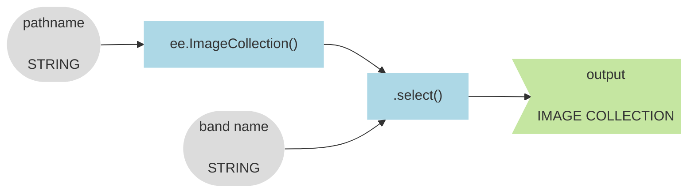

## Introduction  

This tutorial walks you through how to construct an RGB composite that visualizes change in the DMSP/OLS dataset between 1993 and 2013 like the image shown in the [additive color](../rudiments/additive_color.md) chapter.  

The diagram below illustrates the general workflow.  


The tutorial also shows you how to compose your script (using a dictionary and a custom function) so that you can easily change the three years used to define the RGB composite. In other words, the purpose of your script is not simply to deliver a map product, but instead to create a flexible tool for exploring and visualizing the nighttime lights dataset with additive color. 

---

## Start a new script  

<iframe width="720" height="405" src="https://www.youtube.com/embed/xoCHaHzRCJw?si=lTZPkoTunmYVKw6w" title="YouTube video player" frameborder="0" allow="accelerometer; autoplay; clipboard-write; encrypted-media; gyroscope; picture-in-picture; web-share" allowfullscreen></iframe>

```js
// ~~~~~~~~~~~~~~~~~~~~~~~~~~~~~~~~~~~~~~~~~~~~~~~~~~~~~~~~~~~~~~~~~~~~~~~~~~~~~~
//  Name:     changes_in_the_night.js 
//  Author:   Jeff Howarth
//  Date:     10/10/2023 
//  Purpose:  Introduce additive color, nighttime lights, and patterns of change.
// ~~~~~~~~~~~~~~~~~~~~~~~~~~~~~~~~~~~~~~~~~~~~~~~~~~~~~~~~~~~~~~~~~~~~~~~~~~~~~~~  
```

---

## Load image collection and select a band



<iframe width="720" height="405" src="https://www.youtube.com/embed/9f6GMOnaNJo?si=dQV6LFPy9OlGBmZw" title="YouTube video player" frameborder="0" allow="accelerometer; autoplay; clipboard-write; encrypted-media; gyroscope; picture-in-picture; web-share" allowfullscreen></iframe>

```js
// -----------------------------------------------------------------------
//  Load image collection and select a band.  
// -----------------------------------------------------------------------

// Image Collection pathname: "NOAA/DMSP-OLS/NIGHTTIME_LIGHTS"
// Band: "stable_lights"

var collection 
;

print(
  "Collection",
  collection,
  collection.size(),                            
  collection.first(),
  collection.first().bandNames()                
  )
;
```

---

## Create dictionary for study years

<iframe width="720" height="405" src="https://www.youtube.com/embed/Lk-z01jjlC8?si=tHnxFPnjaMewljqk" title="YouTube video player" frameborder="0" allow="accelerometer; autoplay; clipboard-write; encrypted-media; gyroscope; picture-in-picture; web-share" allowfullscreen></iframe>

```js
// -----------------------------------------------------------------------
//  Create a dictionary for study years to assign band 1, 2, 3
// -----------------------------------------------------------------------

// Your goal is to display pixel values in each layer with these colors:
//  2013 with red,
//  2003 with green,
//  1992 with blue.

var yrs = {

};
```

---

## Make image for Band 1


<iframe width="720" height="405" src="https://www.youtube.com/embed/UPlVgpav_FQ?si=gWpF261BVg8zNwBu" title="YouTube video player" frameborder="0" allow="accelerometer; autoplay; clipboard-write; encrypted-media; gyroscope; picture-in-picture; web-share" allowfullscreen></iframe>

```js
// -----------------------------------------------------------------------
//  Make an image for band 1  
// -----------------------------------------------------------------------

var b1 = collection
;

print(
  "Band 1:",
  b1
  )
;
```

---

## Display image as a map layer  

<iframe width="720" height="405" src="https://www.youtube.com/embed/MRZHjkERbg4?si=NEM-gX0LVR8qM6fa" title="YouTube video player" frameborder="0" allow="accelerometer; autoplay; clipboard-write; encrypted-media; gyroscope; picture-in-picture; web-share" allowfullscreen></iframe>

```js
// -----------------------------------------------------------------------
//  Display image as layer on the map.
// -----------------------------------------------------------------------

Map.setCenter(126.8, 33.485, 5);
Map.setOptions('HYBRID');

var viz ;

Map.addLayer();
```

---

## Make and display image for Band 2


<iframe width="720" height="405" src="https://www.youtube.com/embed/_HzhYHCNhnw?si=KmhZxDfEZR_Uf8Xv" title="YouTube video player" frameborder="0" allow="accelerometer; autoplay; clipboard-write; encrypted-media; gyroscope; picture-in-picture; web-share" allowfullscreen></iframe>

```js
// -----------------------------------------------------------------------
//  Make and display image for band 2.  
// -----------------------------------------------------------------------

var b2 
;

print(
  "Band 2:",
  b2
  )
;

Map.addLayer();
```


[_Source_](https://eogdata.mines.edu/products/dmsp/){target=_blank}

---

## Write a function

<iframe width="720" height="405" src="https://www.youtube.com/embed/apii5kp9rA4?si=W1osj81LtIykz78U" title="YouTube video player" frameborder="0" allow="accelerometer; autoplay; clipboard-write; encrypted-media; gyroscope; picture-in-picture; web-share" allowfullscreen></iframe>

```js
// -----------------------------------------------------------------------
//  Write a function  
// -----------------------------------------------------------------------

var makeImageForBand 
  ;

// Call the function

var b1 ;

// Display result as a layer. 

// Map.addLayer();
```

---

## Test generality of function  

<iframe width="720" height="405" src="https://www.youtube.com/embed/KwT0bSjAiak?si=l4nX-et7Ulbn-Ynr" title="YouTube video player" frameborder="0" allow="accelerometer; autoplay; clipboard-write; encrypted-media; gyroscope; picture-in-picture; web-share" allowfullscreen></iframe>

```js
// -----------------------------------------------------------------------
//  Test generality of function.  
// -----------------------------------------------------------------------

// Does .first() and .mean() deliver identical results for b1 case?

var test ;

// Map.addLayer();
```

---

## Revise script to apply function

<iframe width="720" height="405" src="https://www.youtube.com/embed/hfvbH72cBHA?si=kb7EL1vcqqwTqAMM" title="YouTube video player" frameborder="0" allow="accelerometer; autoplay; clipboard-write; encrypted-media; gyroscope; picture-in-picture; web-share" allowfullscreen></iframe>

```js
// -----------------------------------------------------------------------
//  Revise script to apply function. 
// -----------------------------------------------------------------------

// 1. Comment out sections above that made and drew b1 and b2;

// 2. Redefine map options and viz parameters (that were commented out).

Map.setCenter(126.8, 33.485, 5);
Map.setOptions('HYBRID');

var viz = {min:0, max: 63};

// 3. Call function to remake all bands

var b1 ;
var b2 ;
var b3 ;

// 4. Add results as layers to map.

Map.addLayer();
// 
```

---

## Make and display RGB composite image  


<iframe width="560" height="315" src="https://www.youtube.com/embed/qp6pKLVj9sU?si=o0nB6jHfhNUp8Wb0" title="YouTube video player" frameborder="0" allow="accelerometer; autoplay; clipboard-write; encrypted-media; gyroscope; picture-in-picture; web-share" allowfullscreen></iframe>

```js
// -----------------------------------------------------------------------
//  Construct and display three band image from the three images.  
// -----------------------------------------------------------------------

// Create image. 

var change_image 
;

print(
  "Change Image",
  change_image
  )
;

// Display result as a map layer. 

Map.addLayer();

```

---

<a rel="license" href="http://creativecommons.org/licenses/by-nc-nd/4.0/"></a><br />This work is licensed under a <a rel="license" href="http://creativecommons.org/licenses/by-nc-nd/4.0/">Creative Commons Attribution-NonCommercial-NoDerivs 4.0 International License</a>.