## Introduction 

This tutorial aims to answer the question:  

> In 2016, where was the best potential habitat for grassland birds in the Champlain Valley that was owned by Middlebury College?

To answer this question, we will develop a model based on [these guidelines][anr01]{target=_blank} developed by the Vermont Agency of Natural Resources.  

## Background  

The Bobolink (_Dolichonyx oryzivorus_) is a grassland bird species with a bubbling song and a remarkable life cycle. Bobolinks winter in South America, primarily Paraguay, Argentina, and Bolivia. In the spring, they migrate back to their breeding habitats in North America, including grassland habitat here in the Champlain Valley. Interestingly, Bobolinks seem to have keen spatial memory and sense of place; they tend to return to the same specific field each summer to breed and research indicates that this "site fidelity" improves breeding success. 


_source:_ [_iNaturalist_][photo]{target=_blank}

Bobolinks are also an interesting example of a "new native" species. During Abenaki times, Bobolinks did not breed in Vermont, because there was very little grassland habitat for them to do so. Open, grassy habitat was uncommon in what we now call the Champlain Valley; the landscape here was largely forested, save for the margins of water bodies and places where Abekai cultivated crops or set fires at a frequency that prevented trees from growing. Following the American Revolution, white migrants appropriated Abenaki lands in the Champlain Valley and pitched farms, claiming the land by clearing it of trees. This created large expanses of open habitat in the formerly forested landscape. Bobolinks soon colonized this new habitat, migrating from native breeding territories on the midwestern prairies of North America.  

Today, Vermont plays an important role in the conservation of Bobolinks and other native North American grassland species. Since the 1940s, breeding populations of Bobolinks have significantly declined across North America, primarily from habitat loss caused by both changes in agricultural practices and the conversion of agricultural land into other land uses. 

This tutorial develops a model with Earth Engine to identify where Middlebury College owns land that could contribute to the conservation of native North American grassland bird species by protecting the open structure of the habitat and working with farmers to adapt land use practices that do not conflict with breeding cycles of grassland birds.   

## Criteria  

According to the ANR guidelines, the best potential habitat for Bobolink and other grassland bird species should meet the following criteria: 

1. Open land cover (grass/shrub, water, bare);
2. Buffered from the edge, or with a core area that is at least 50 meters from closed habitat structure (tree canopy) or developed land (roads, buildings, pavement, etc);  
3. Large, or at least 20 acres in area;
4. With a large interior, or a perimeter-area ratio of 0.015 or less. 

[anr01]: https://vtfishandwildlife.com/sites/fishandwildlife/files/documents/Conserve/RegulatoryReview/Guidelines/Grassland-Bird-Habitat-Conservation-Guidance-2021.pdf

[photo]: https://www.inaturalist.org/taxa/10487-Dolichonyx-oryzivorus

---  

## Start a new script

<iframe width="720" height="405" src="https://www.youtube.com/embed/-6xHgblRxWs?si=pmwang3Z6_4iJp_b" title="YouTube video player" frameborder="0" allow="accelerometer; autoplay; clipboard-write; encrypted-media; gyroscope; picture-in-picture; web-share" allowfullscreen></iframe>


```js
// ~~~~~~~~~~~~~~~~~~~~~~~~~~~~~~~~~~~~~~~~~~~~~~~~~~~~~~~~~~~~~~~~~~~~~~~~~~~
//
//  Grassland bird habitat on Middlebury College Lands in Champlain Valley. 
//  
//  Jeff Howarth 
//  Sept 30, 2023
//
// ~~~~~~~~~~~~~~~~~~~~~~~~~~~~~~~~~~~~~~~~~~~~~~~~~~~~~~~~~~~~~~~~~~~~~~~~~~~
```

---

## 1. Load feature collection and filter by attribute

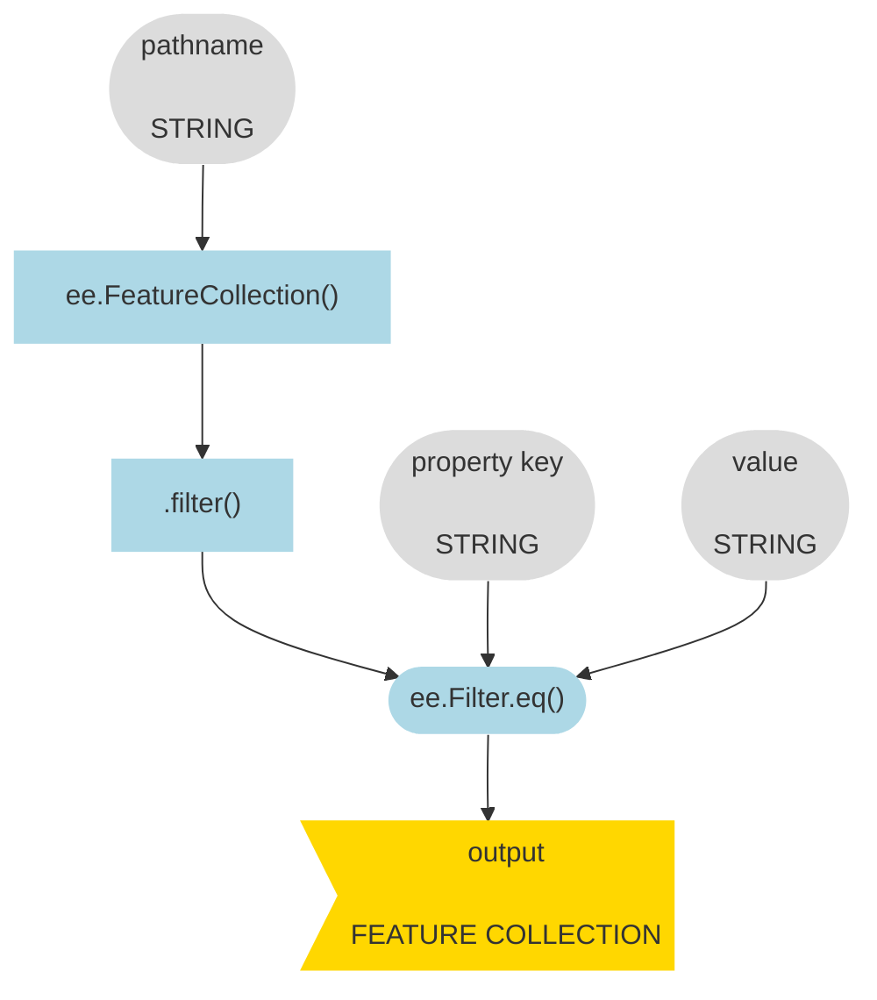

<iframe width="720" height="405" src="https://www.youtube.com/embed/9Dc0zxy2x1I?si=afXBeSU2CAxo02ej" title="YouTube video player" frameborder="0" allow="accelerometer; autoplay; clipboard-write; encrypted-media; gyroscope; picture-in-picture; web-share" allowfullscreen></iframe>


```js
// ---------------------------------------------------------------------------
//  1. Load feature collection and filter by attribute.
//
//  Isolate Champlain Lowlands.
// ---------------------------------------------------------------------------

var region = ee.FeatureCollection("projects/conservation-atlas/assets/regions/Ecoregion_07232023");

print(
  "STEP 1:"
  )
;

Map.addLayer();
```

---

## 2. Load feature collection and filter by location

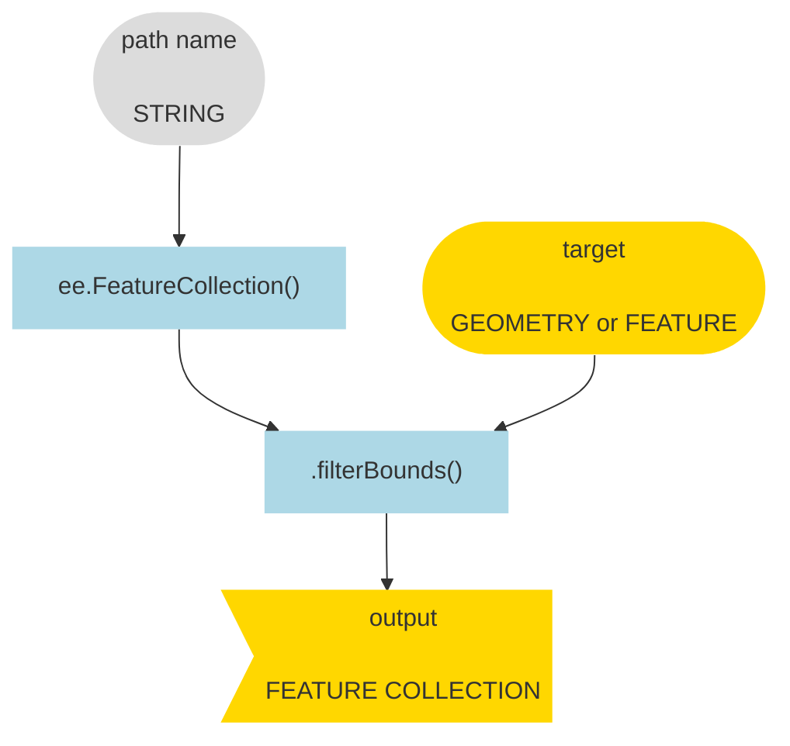

<iframe width="720" height="405" src="https://www.youtube.com/embed/PNAnfKmJYbg?si=L9JMaEV26sVZeuwL" title="YouTube video player" frameborder="0" allow="accelerometer; autoplay; clipboard-write; encrypted-media; gyroscope; picture-in-picture; web-share" allowfullscreen></iframe>

```js
// ---------------------------------------------------------------------------
//  2. Load feature collection and filter by location,
//
//  Isolate College Lands in Champlain Valley.
// ---------------------------------------------------------------------------

var college_lands = ee.FeatureCollection("projects/conservation-atlas/assets/cadastre/Midd_College_Parcels_withattributes");

print(
  "STEP 2:"
  )
;

Map.centerObject();
Map.setOptions();

Map.addLayer();
```

---

## 3. Define study region  

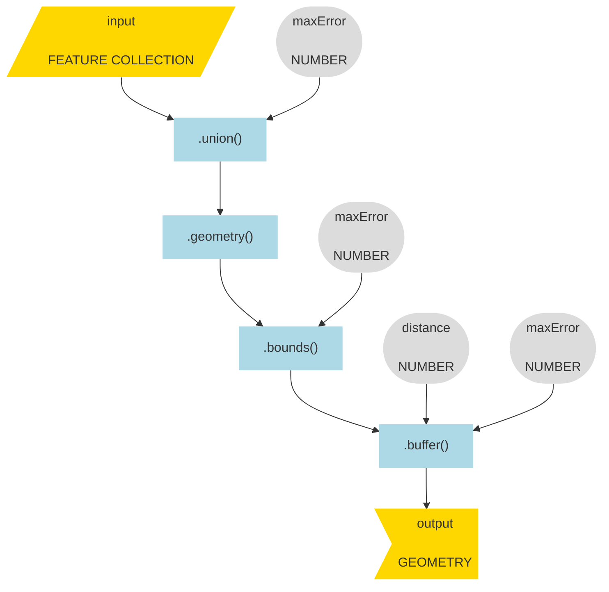

<iframe width="720" height="405" src="https://www.youtube.com/embed/-4dzn5gy_ps?si=8uLRWTztpUi20cDJ" title="YouTube video player" frameborder="0" allow="accelerometer; autoplay; clipboard-write; encrypted-media; gyroscope; picture-in-picture; web-share" allowfullscreen></iframe>

```js
// ---------------------------------------------------------------------------
// 3. Define study region
// ---------------------------------------------------------------------------

var bounds ;

print(
  "STEP 3:",
  bounds
  )
;

Map.addLayer();
```

---

## 4. Load an image

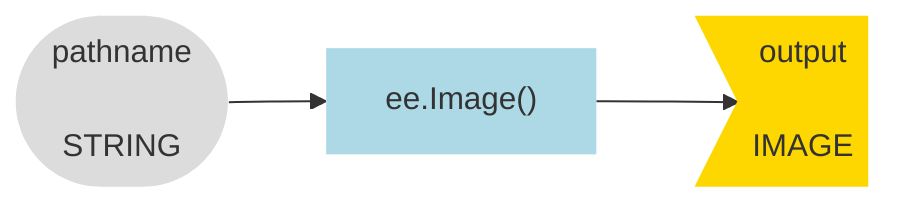

<iframe width="720" height="405" src="https://www.youtube.com/embed/PpbGfoXpQcM?si=Gvfs13mb8b53NLrX" title="YouTube video player" frameborder="0" allow="accelerometer; autoplay; clipboard-write; encrypted-media; gyroscope; picture-in-picture; web-share" allowfullscreen></iframe>

```js
// ---------------------------------------------------------------------------
//  4. Load an image
//
//  Import land cover image for Vermont.
// ---------------------------------------------------------------------------

var lc ;

var lc_viz = {
  min: 1,
  max: 8,
  palette: [
    '#ABD998',    //   1. Tree Canopy  
    '#EBF09C',    //   2. Grass/Shrub 
    '#f7f7f7',    //   3. Bare soil
    '#95E6D5',    //   4. Water
    '#525252',    //   5. Buildings    
    '#F7F7F7',    //   6. Roads
    '#cccccc',    //   7. 0ther pavement
    '#F7F7F7',    //   8. Railroads  
    ]
  };

print(
  "STEP 4:", 
  lc,
  lc.projection()
  )
;
  
Map.addLayer();
```

---

## 5. Reclassify an image

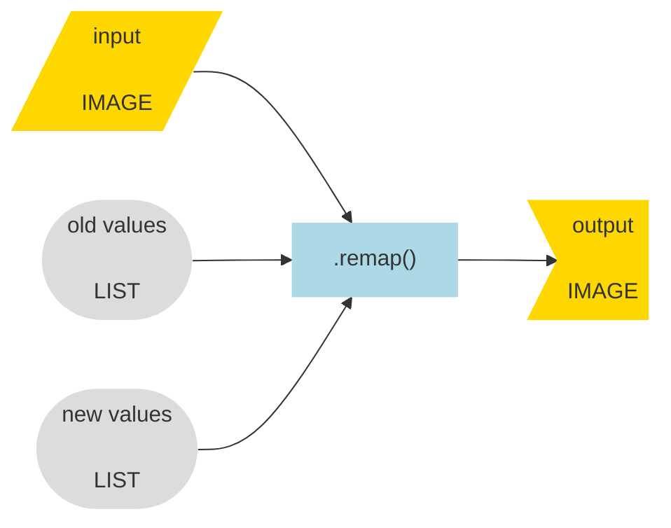

<iframe width="720" height="405" src="https://www.youtube.com/embed/EOHXIr2g_rs?si=EuzVmAnn9y3Wx1-x" title="YouTube video player" frameborder="0" allow="accelerometer; autoplay; clipboard-write; encrypted-media; gyroscope; picture-in-picture; web-share" allowfullscreen></iframe>

```js
// ---------------------------------------------------------------------------
//  5. Reclassify an image
//
//  Make a binary image of grasslands.  
// ---------------------------------------------------------------------------

var lc_binary ;

print(
  "STEP 5:",
  lc_binary,
  lc_binary.projection()
  )
;

Map.addLayer();
```

---

## 6. Clip image by region  

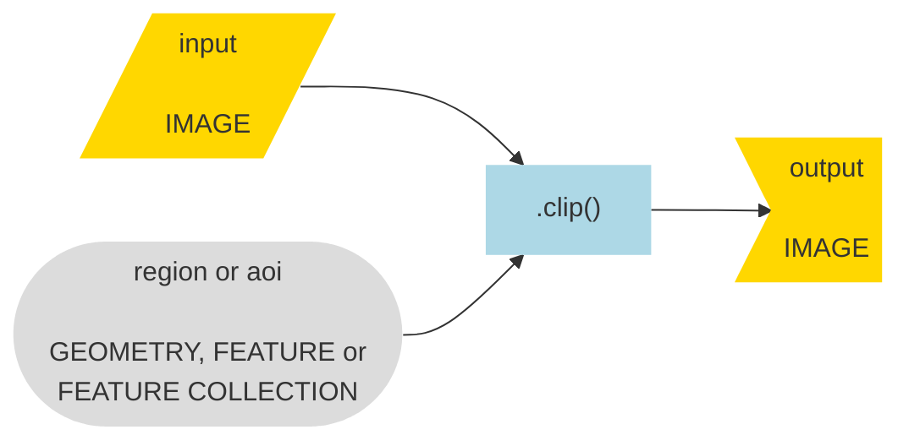

<iframe width="720" height="405" src="https://www.youtube.com/embed/vaojIs242gY?si=GhmRQsoOv1NX_06D" title="YouTube video player" frameborder="0" allow="accelerometer; autoplay; clipboard-write; encrypted-media; gyroscope; picture-in-picture; web-share" allowfullscreen></iframe>

```js
// ---------------------------------------------------------------------------
//  6. Clip image by region
//
//  Isolate grasslands in study region. 
// ---------------------------------------------------------------------------

var lc_binary_bounds ;

print(
  "STEP 6:",
  lc_binary_bounds,
  lc_binary_bounds.projection()
  )
;

Map.addLayer();

```

---

## 7. Select by pixel value 


<iframe width="720" height="405" src="https://www.youtube.com/embed/64qp__GXrIw?si=_8rJKpWYoRtaH4RF" title="YouTube video player" frameborder="0" allow="accelerometer; autoplay; clipboard-write; encrypted-media; gyroscope; picture-in-picture; web-share" allowfullscreen></iframe>

```js
// ---------------------------------------------------------------------------
//  7. Select by pixel value.
//
//  Invert the grassland binary. 
// ---------------------------------------------------------------------------

var invert_binary ;

print(
  "STEP 7:",
  invert_binary,
  invert_binary.projection()
  )
;

Map.addLayer();
```

---

## 8. Compute distance  

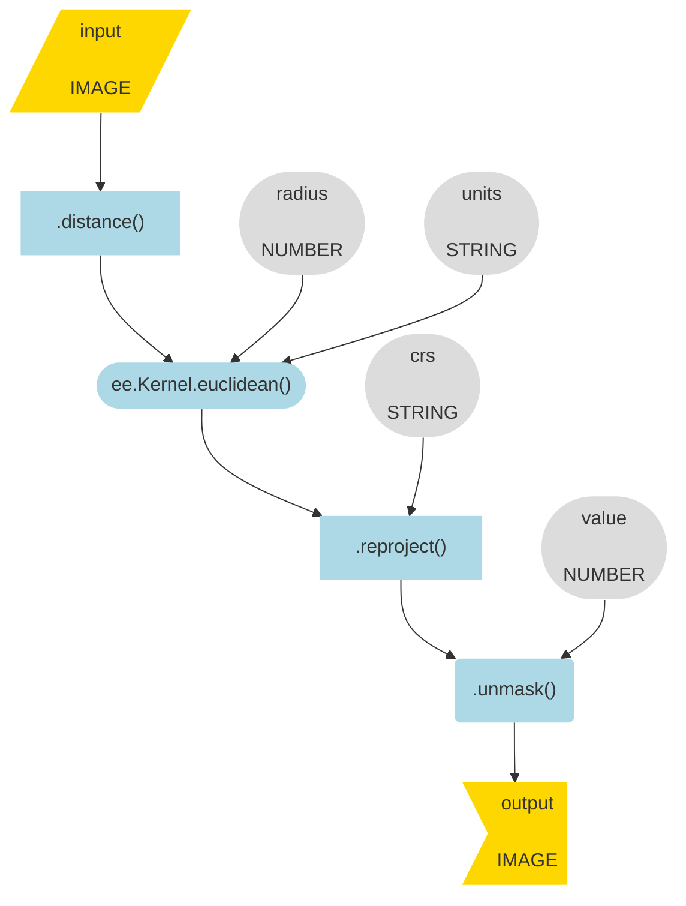

<iframe width="720" height="405" src="https://www.youtube.com/embed/8hGTmmWUPyE?si=P6RxzGAYPK44kQIL" title="YouTube video player" frameborder="0" allow="accelerometer; autoplay; clipboard-write; encrypted-media; gyroscope; picture-in-picture; web-share" allowfullscreen></iframe>

```js
// ---------------------------------------------------------------------------
//  8. Compute distance 
//
//  Calculate distance from edge of grasslands towards interior
// ---------------------------------------------------------------------------

var crs = "EPSG: 32145"; // Vermont State Plane North American Datum 1983

var grassland_distance ;

print(
  "Step 8:",
  grassland_distance,
  grassland_distance.projection()
  )
;

// Here is a nice palette that looks good for distance when you reverse it.

var inferno = ["#000004", "#320A5A", "#781B6C", "#BB3654", "#EC6824", "#FBB41A", "#FCFFA4"].reverse();

Map.addLayer();
```

---

## 9. Select by a threshold value

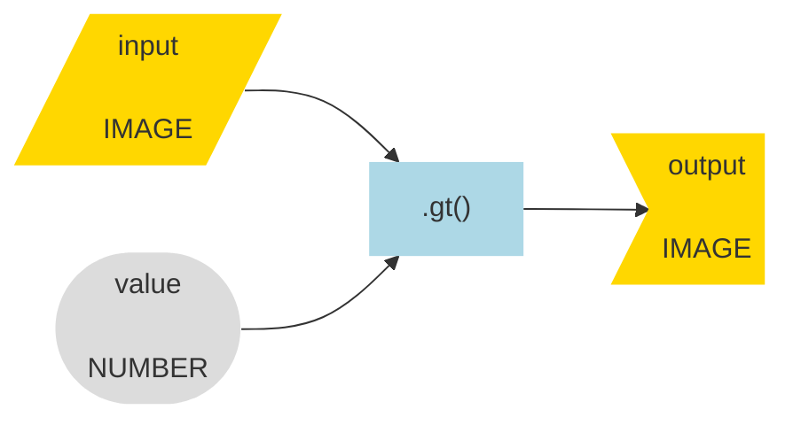

<iframe width="720" height="405" src="https://www.youtube.com/embed/_CuSV5vHSbA?si=WpIP-MX17D833VqR" title="YouTube video player" frameborder="0" allow="accelerometer; autoplay; clipboard-write; encrypted-media; gyroscope; picture-in-picture; web-share" allowfullscreen></iframe>

```js
// ---------------------------------------------------------------------------
//  9. Select by threshold value 
//
//  Isolate all pixels that are greater than 50 meters from grassland edge. 
// ---------------------------------------------------------------------------

var grassland_cores ;

print(
  "Step 9:",
  grassland_cores,
  grassland_cores.projection()
  )
;

Map.addLayer();

```

---

## 10. Zonal overlay

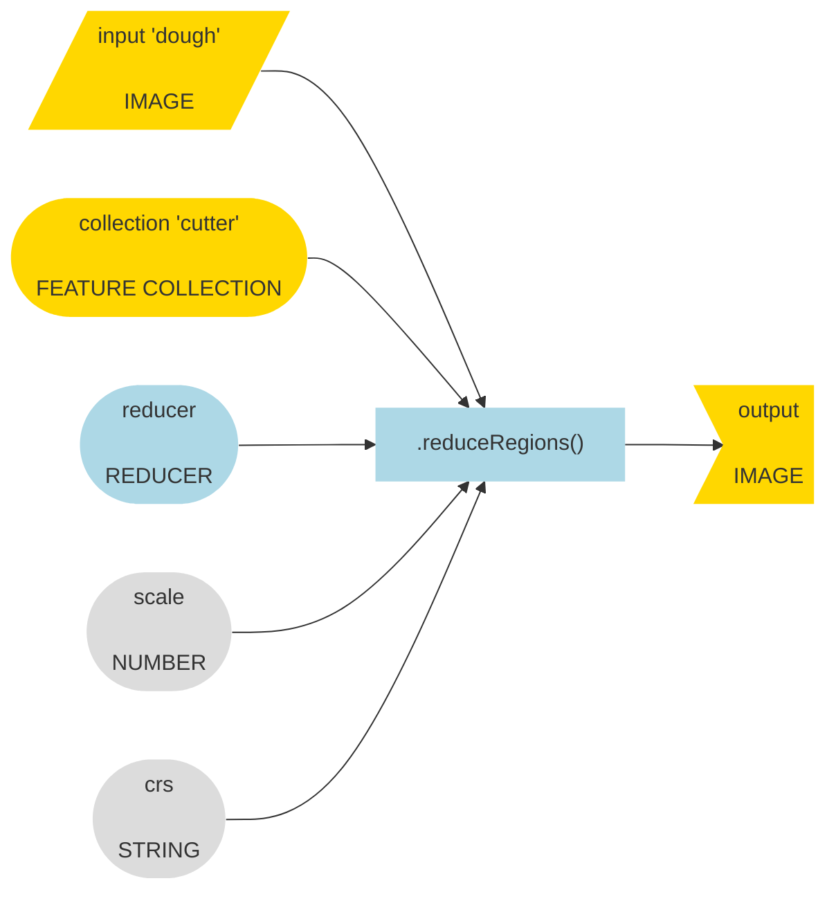

<iframe width="720" height="405" src="https://www.youtube.com/embed/WxU2h6dt4tM?si=taLFaE_EkMIH4FI0" title="YouTube video player" frameborder="0" allow="accelerometer; autoplay; clipboard-write; encrypted-media; gyroscope; picture-in-picture; web-share" allowfullscreen></iframe>

```js
// ---------------------------------------------------------------------------
//  10. Zonal overlay 
//
//  Find college parcels that overlap core grassland habitat. 
// ---------------------------------------------------------------------------

var college_with_core ;

var college_with_core_filter ;

print(
  "STEP 10:",
  college_with_core.size(),
  college_with_core_filter.size()
  )
;

Map.addLayer();
```

---

## 11. Mask an image.

__Case 1:__ to use an image to mask another image.

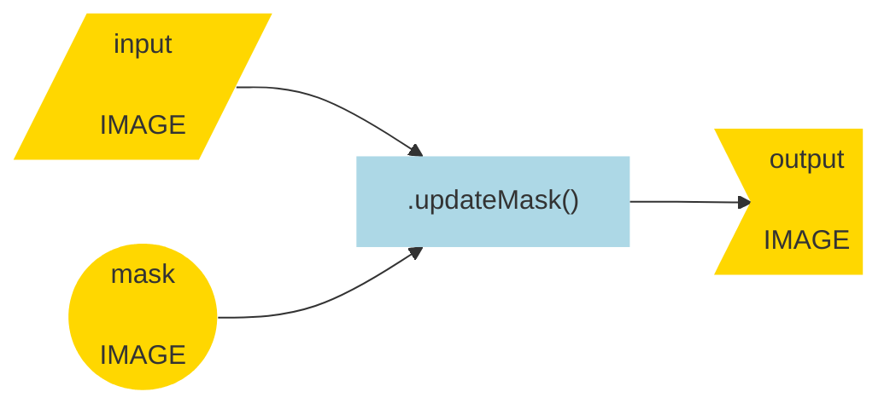

__Case 2:__ to use an image to mask itself:  

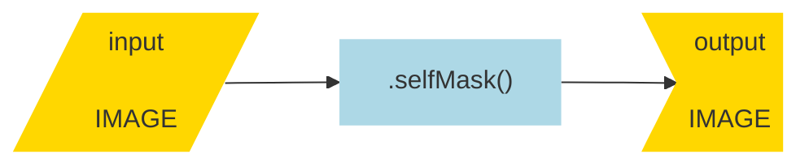

<iframe width="720" height="405" src="https://www.youtube.com/embed/MoqbeTucypc?si=wUyiszjggDRYDoVe" title="YouTube video player" frameborder="0" allow="accelerometer; autoplay; clipboard-write; encrypted-media; gyroscope; picture-in-picture; web-share" allowfullscreen></iframe>

```js
// ---------------------------------------------------------------------------
//  11. Mask an image
//
//  Ignore all pixels that are not grasslands. 
// ---------------------------------------------------------------------------

var grassland_cores_masked;      

print(
  "STEP 11:",
  grassland_cores_masked,
  grassland_cores_masked.projection()
  )
;

Map.addLayer();

```

---

## 12. Make objects   

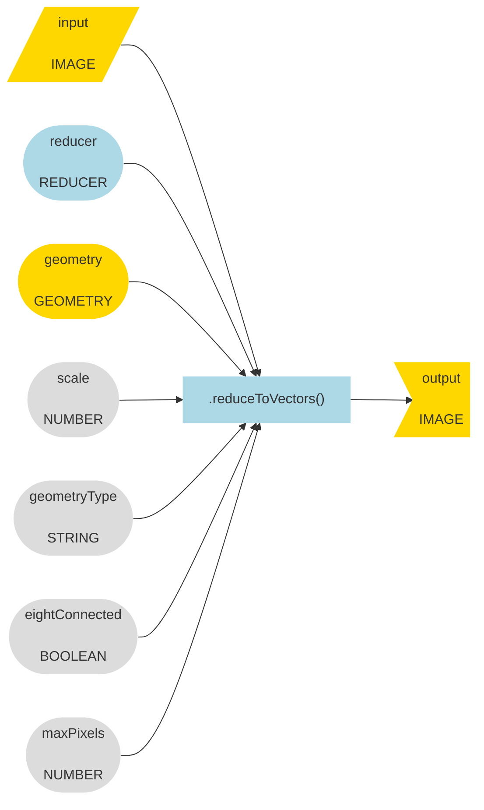

<iframe width="720" height="405" src="https://www.youtube.com/embed/wROroakCXQU?si=pyjYezz6Kv6T5HyR" title="YouTube video player" frameborder="0" allow="accelerometer; autoplay; clipboard-write; encrypted-media; gyroscope; picture-in-picture; web-share" allowfullscreen></iframe>

```js
// ---------------------------------------------------------------------------
//  12. Make objects. 
//
//  Identify contiguous regions of grassland. 
// ---------------------------------------------------------------------------

var grassland_objects ;

print(
  "STEP 12:",
  grassland_objects
  )
;

Map.addLayer();
```

---

## 13. Select by location  

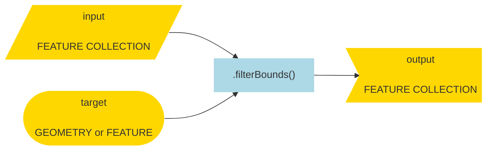

<iframe width="720" height="405" src="https://www.youtube.com/embed/jUoOV2sTm8I?si=BTW_TliZ0Prkdr9-" title="YouTube video player" frameborder="0" allow="accelerometer; autoplay; clipboard-write; encrypted-media; gyroscope; picture-in-picture; web-share" allowfullscreen></iframe>

```js
// ---------------------------------------------------------------------------
//  13. Select by location.
//
//  Isolate grasslands on College Lands. 
// ---------------------------------------------------------------------------

var college_grasslands ;

print(
  "STEP 13:",
  college_grasslands.size(),
  college_grasslands.first()
  )
;

Map.addLayer();
```

---

## 14. Compute spatial attributes

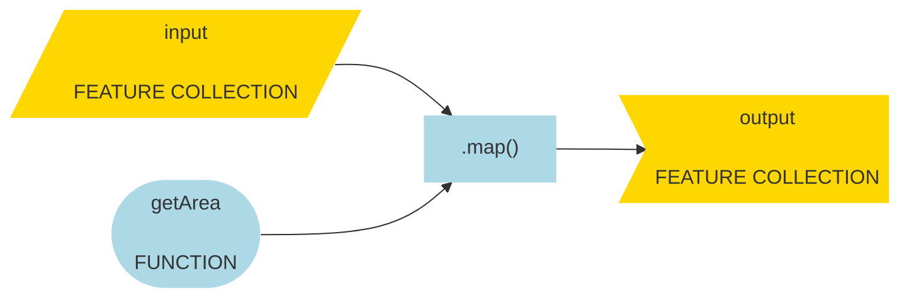

<iframe width="720" height="405" src="https://www.youtube.com/embed/GZrXo1CU9Qo?si=Ykvxy3hnyGAbwgcL" title="YouTube video player" frameborder="0" allow="accelerometer; autoplay; clipboard-write; encrypted-media; gyroscope; picture-in-picture; web-share" allowfullscreen></iframe>

```js
// ---------------------------------------------------------------------------
//  14. Compute spatial attributes.
//
//  Calculate area and perimeter-area ratios.
// ---------------------------------------------------------------------------

var getArea = function(f) {
  var crs = "EPSG: 32145"; // Vermont State Plane North American Datum 1983
  var area = f.area(1, crs).divide(4046.86);
  var pa = f.perimeter(1, crs).divide(f.area(1, crs));
  return f.set({"area": area, "pa": pa});
};

var grasslands_with_criteria ;

print(
  "STEP 14:",
  grasslands_with_criteria.size(),
  grasslands_with_criteria.first()
  )
;

Map.addLayer();
```

---

## 15. Select by two attributes

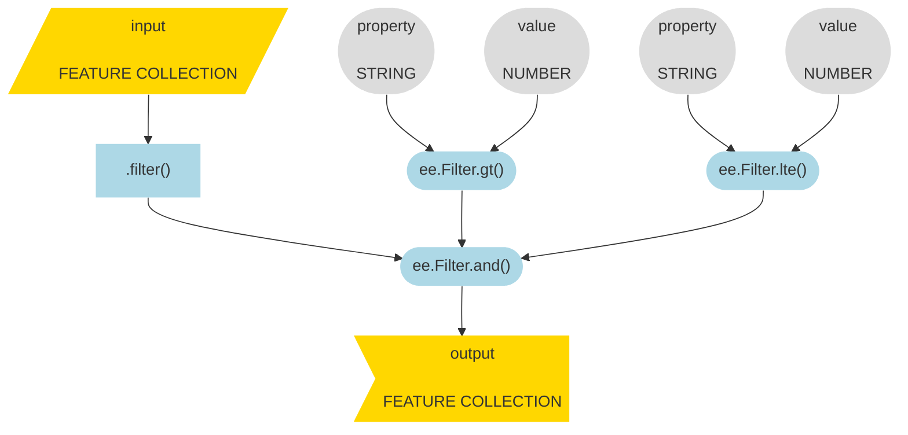

<iframe width="720" height="405" src="https://www.youtube.com/embed/CNV0PMe_Ofk?si=zXajXqlHxl8HGuWe" title="YouTube video player" frameborder="0" allow="accelerometer; autoplay; clipboard-write; encrypted-media; gyroscope; picture-in-picture; web-share" allowfullscreen></iframe>

```js
// ---------------------------------------------------------------------------
//  15. Select by two attributes
//
//  Identify grasslands that meet both criteria.
// ---------------------------------------------------------------------------

var best_grassland_habitat ;

print(
  "STEP 15:",
  best_grassland_habitat.size(),
  best_grassland_habitat.first()
  )
;

Map.addLayer();
```

---

## 16. Export to EE Asset

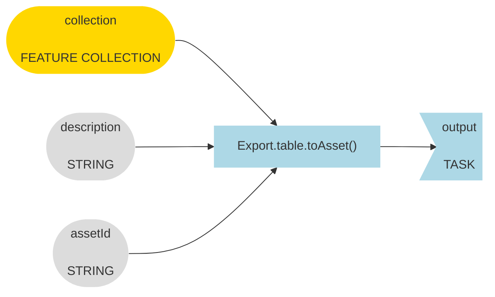

<iframe width="720" height="405" src="https://www.youtube.com/embed/93-7gsmORZc?si=rm69ILxOCWuhgxG7" title="YouTube video player" frameborder="0" allow="accelerometer; autoplay; clipboard-write; encrypted-media; gyroscope; picture-in-picture; web-share" allowfullscreen></iframe>

```js
// ---------------------------------------------------------------------------
//  16. Export to EE Asset
//
//  To run workflow with crs condition on distance (Step 10).
// ---------------------------------------------------------------------------

var x_name = "Best_college_grasslands_0930_2023"; 

Export.table.toAsset({
  collection: best_grassland_habitat, 
  description: x_name, 
  assetId: x_name
  }
);
```